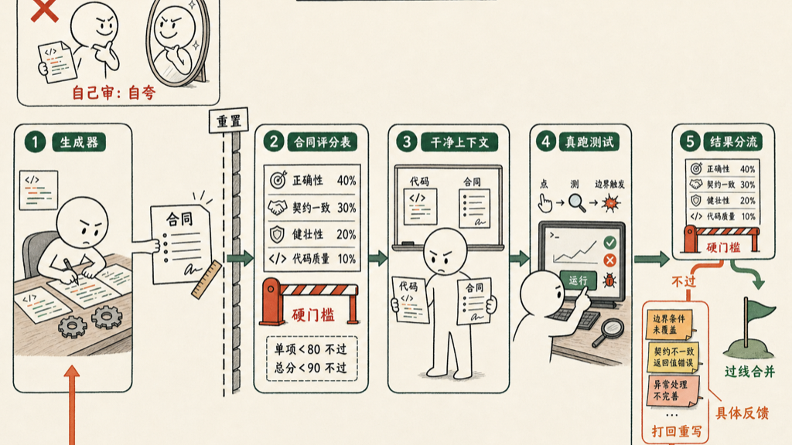

AI 写完代码，别急着合并。也别问他「这代码行不行」——他只会自信地夸自己。

正确的做法：另起一个上下文干净的 agent，拿一份事先写好的合同给这份代码打分，过线才算过。

## 为什么不能让他自己审

Anthropic 那篇讲长任务 harness 设计的文章，把这件事说透了：agent 评自己的活，几乎总是「自信地夸奖，哪怕在人看来质量明显平庸」。

这不是模型不行，是结构不对。让同一个 agent 既当运动员又当裁判，他没有动机挑自己的刺。文章里那句话我很认同：把一个独立的评审调教得足够挑剔，远比让生成者学会批判自己容易。

这是 GAN 的老思路——生成器和判别器分开，对抗着往前走。代码这件事也一样：写的人和验的人，必须是两个脑子。

## 为什么要「干净的上下文」

光换个角色还不够，得换个上下文。

同一个对话窗口里待久了，agent 会染上文章说的「上下文焦虑」——眼看快到上限，就慌慌张张草草收尾。你让他在这种状态下回头审自己刚写的几百行，他带着写代码时的全部假设和疲劳，看不见自己的盲点。

文章给的解法是 context reset 而不是 compaction：压缩只是把历史摘要塞回去，焦虑还在；重置是直接清空、给一块干净石板，再用结构化的交接把必要信息递过去。

所以评审 agent 要新开一个，上下文从零开始。他不知道你写代码时纠结过什么、妥协过什么，只对着代码和合同看——这种「无知」恰恰是他的价值。

## 合同：评审的基准线

但评审不能凭感觉。「我觉得还行」和生成器的自夸是一个毛病，换个人犯而已。

得有一条客观基准线，这就是合同。

Anthropic 把它叫 sprint contract：动手写代码之前，生成器先提出「我要做成什么样、怎么验证算成功」，评审审过这份提案，双方达成一致。合同把高层的 spec 落成可测的、有明确过 / 不过标准的条款。

顺序很关键——合同在写代码之前定，不是事后找补。先有标尺，再有活。

## 写一份合同长什么样

合同的核心是一张加权评分表，外加硬门槛。我自己用的模板大概这样：

```markdown
# Review Contract: <feature 名>

## 评分项（加权）
- 正确性     40%  所有验收场景跑通；边界、空输入、错误路径都覆盖
- 契约一致   30%  实现与 spec 的每条 SHALL 一一对应，无遗漏、无夹带
- 健壮性     20%  并发、超时、异常输入下不崩、不静默吞错
- 代码质量   10%  可读、无重复、命名达意

## 通过条件（全部满足才算过）
- 任一评分项 < 80 → 整体不过
- 加权总分 < 90 → 不过
- 不过则带着逐条 bug 反馈打回生成器重写
```

关键不在分数本身，在两点。

第一，**硬门槛**。不是算平均分糊弄过去。文章里说得很直白：每条标准都有硬门槛，任何一条掉到线下，整个 sprint 就算失败。一个正确性 50 分的活，不该靠代码质量 100 分拉平均蒙混过关。

第二，**反馈要具体到能直接改**。评审不是打个分就走，是对着合同逐条挑 bug，具体到行。文章给的例子是这种颗粒度：「删除键的处理要求 selection 和 selectedEntityId 同时置位，但点击实体只置了 selectedEntityId」——这种反馈生成器拿到就能改，不像「健壮性不足」那样等于没说。

## 走一遍：一次真实的打回

假设生成器刚写完一个「批量删除选中条目」的功能，提交评审。评审 agent 新开、上下文干净，照着上面那份合同把应用跑起来打分。

第一轮：

- 正确性 55 —— 单击一个实体能删；但框选多个再按删除键，只删掉了最后点中的那一个
- 契约一致 90
- 健壮性 70 —— 对空选区按删除，抛了个未捕获的异常
- 代码质量 85

正确性 55 < 80，撞上硬门槛，整体直接判不过。评审不算总分、不和稀泥，回一条具体到行的反馈：

> 删除逻辑同时依赖 `selection`（框选集合）和 `selectedEntityId`（单击目标），但批量删除路径只读了 `selectedEntityId`，所以框选多项时只删一个。另外空选区没做判空，会触发异常。

生成器拿到这条，不用猜错在哪：删除时改成遍历 `selection`，集合为空就提前返回。

第二轮再审：正确性 95、契约一致 95、健壮性 90、代码质量 88，无项低于 80，加权总分 92 ≥ 90 —— 过。

整个过程我没读一行代码。我只看了那条打回的反馈，确认它说的是真问题。这正是这套结构省下的事：把「判断代码好不好」从我身上，挪给一个带着合同、上下文干净的评审。

## 评审要真跑，不是读

还有一条最容易被忽略：评审 agent 不能只读静态代码。

Anthropic 的评审是拿 Playwright 把应用真跑起来，点、测、触发边界，再对着合同记 bug。读代码能看出结构问题，但「点击实体只置了一个状态」这种，只有跑起来才抓得到。

所以评审手里要有工具，能执行、能观察、能验证，而不是对着 diff 凭空想象。



## 一句话

写代码的和验代码的，得是两个脑子、两个上下文，中间隔一份事先签好的合同。生成器负责把活干到合同满意，评审负责拿着合同一条条卡——过线才算完，不过就带着具体反馈打回重写。

补一句成本账：模型越强，这套 harness 越该瘦身。等哪天模型单飞就足够可靠，这道评审就是多余的开销。但只要任务还超出模型能稳稳独立完成的边界，这份合同和这个干净的评审，就值。

## 参考资料

- [Anthropic: Harness Design for Long-Running Agent Applications](https://www.anthropic.com/engineering/harness-design-long-running-apps)

如有错误或不严谨之处，欢迎评论区指正。
