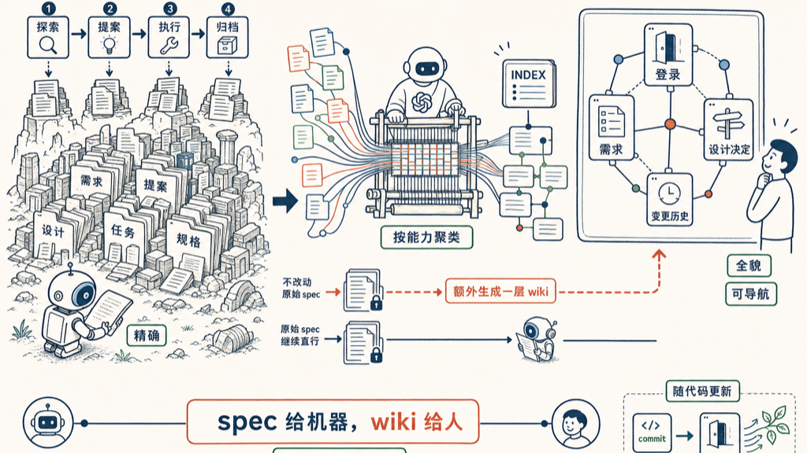

OpenSpec 把规格写得滴水不漏，代价是文档爆炸。我现在的解法：让 LLM 把它们重新织成一个 wiki。

## 先说问题

OpenSpec 是好东西。它逼你先把「要做什么」写成规格，再动手写代码——SHALL 语句、场景、任务拆解，一条不漏。配上 Superpowers 之后更狠，opsx-superpowers 把整个流程切成四步：`/opsx:explore` 把模糊想法变成评审过的需求，`/opsx:propose` 把需求变成完整的变更包，`/opsx:apply` 带着强制 TDD 执行，`/opsx:archive` 收尾归档。

每一步都对。问题是每一步都生文档。

一个 topic 走完，`openspec/changes/<topic>/` 底下就躺着 `proposal.md`、`design.md`、`tasks.md`，外加 `specs/<capability>/spec.md`；前面还有 `requirements.md`，后面还跟着 `contracts/`、`eval-log.md`。几十个 topic 攒下来，specs 目录像个考古现场——层层叠叠，每层都有用，可没人能一眼看懂全貌。

## 这些文档是给机器读的

这是我想明白的第一件事：spec 本来就不是给人读的。

SHALL 语句精确、场景可执行、任务能对着打勾——这套结构是给 agent 看的，机器顺着它一步步落地，严丝合缝。但人不是这么读东西的。人要的是「这项目大概分几块」「登录那块的规格在哪」「这个决定当初为什么这么定」。让人去 `grep` 几十个 `spec.md`，等于让你读源码去理解一座城市的交通。

机器要精确，人要地图。同一堆文档喂不饱两边。

## Karpathy 的 LLM wiki

转机是 Karpathy 那个 LLM wiki 的想法。他一句话点透：「Obsidian is the IDE; the LLM is the programmer; the wiki is the codebase.」一堆互链的 markdown，由 LLM 自己写、自己分类、自己查一致性——知识不是一次写死，是慢慢喂、慢慢长。

我现在在做的，就是把这个想法对准那堆 spec。

让他通读全部规格文档，按能力聚类，先生成一个 `INDEX.md`：告诉人这项目有哪些模块、每块的规格在哪、改动历史串成什么线。再往深一层，把零散的 `spec.md` 重新组织成互链的 wiki 页——点「登录」，跳得到它的需求、设计决定、相关变更，而不是在十个文件夹里来回翻。原始 spec 一个字不动，继续喂给机器；wiki 是另起一层，专门给人看。

最妙的是它能跟着代码长。每次 commit 之后，后台一个 agent 读 diff、更新 wiki——文档不再是写完就过期的快照，而是跟着代码一起呼吸的活地图。这跟 DeepWiki 那类工具是一个路子，只不过我对准的是 spec，不是源码。

## 一句话

spec 给机器，wiki 给人，LLM 在中间当翻译。OpenSpec 负责把规格写到机器满意，LLM wiki 负责把规格读到人能懂——两层各干各的，谁也别将就谁。

这事我还在试，wiki 的结构、索引的颗粒度都在调。但方向我是信的：文档多不是病，文档没有索引才是病。

## 参考资料

- [Karpathy's LLM Wiki (gist)](https://gist.github.com/karpathy/442a6bf555914893e9891c11519de94f)

如有错误或不严谨之处，欢迎评论区指正。
