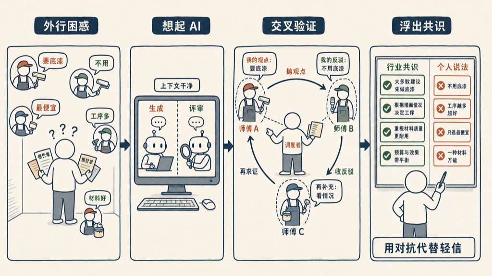

最近在给房间刷油漆，意外把 AI 里的一个套路用到了现实——而且出奇地好用。

事情是这样的。

## 一个外行，面对五个说法

刷房间这事看着简单，真问起来全是坑。我在网上找了好几个油漆师傅咨询，结果每个人的说法都不一样，还常常打架。

一个说墙面必须先刷一遍底漆，不然过两年准起皮；另一个说这种墙根本不用，底漆是多挣的一道工钱。一个报价是别人的两倍，说贵在工序和材料；一个张口就比谁都便宜。

我一个外行，手里没有这行的任何底子。单听任何一个，他说什么我信什么——我没有判断的支点。

## 我想起了 vibe coding 里那一条

卡在这儿的时候，我想起在 AI vibe coding 里学到的一招：

**别让写代码的那个 agent 自己判断代码行不行；另起一个上下文干净的 agent，专门来 review 它的产出。**

精髓在「上下文干净」四个字。新来的 agent 不知道前一个纠结过什么、妥协过什么，不被它的思路带跑，才能独立、公正地挑刺。生成的人总会偏袒自己，评审的人必须够冷、够独立。

我忽然意识到：这套东西，不挑场景。师傅，不就是一个个 agent 吗？

## 把师傅当 agent 来调度

于是我没让师傅们互相认识，而是自己做中间人。

我把 A 师傅的说法，原样抛给 B 师傅，让他 challenge：「有人说这墙不用刷底漆，你怎么看？」B 不知道 A 是谁，带着自己的经验、干净的立场，要么反驳，要么印证。我再把 B 的反驳，丢回去问 C。

几轮下来，神奇的事发生了：哪些是全行业的共识、哪些是某个人想省事、哪些是单纯漫天要价，自己就浮出水面了。所有人都说要做的，大概率真得做；只有一个人坚持、别人都摇头的，基本可以划掉。

我没有下场跟任何人比手艺——我比不过。我做的是调度：抛观点、收反驳、交叉验证、最后综合。那个「最佳结论」，不是某一个师傅给我的，是我从他们的对抗里提炼出来的。

## 为什么这么干就对了

道理和代码里一模一样。

一个人自评，几乎总往好里说——师傅当然夸自己的方案。可一旦让一个利益不相关、上下文独立的人来 challenge，偏袒和盲区就藏不住了。这正是 generator-evaluator 分离的意义：评审要够挑剔，而且绝不能被生成者的上下文污染。

我做的，就是手动跑了一遍多 agent 的交叉评审，只不过 agent 换成了大活人。

当然，现实比代码脏得多。师傅之间可能有行业默契、我问的方式也可能带着偏向，不像程序里的 agent 那么干净利落。但方向是对的：与其轻信一个权威，不如制造一场受控的对抗。

## 所以这算活学活用吗

我觉得算，而且这才叫真学到了。

vibe coding 教给我的，从来不只是「怎么让 AI 写代码」。它底下是一套怎么逼近正确的思维：分离生成与评审、保持上下文干净、用对抗代替轻信、自己站在调度者的位置上。

这套思维不挑场景。写代码能用，买大件、看病咨询、找装修师傅，一样能用。

工具会过时，套路不会。把「多 agent 互审」这件事真正学进脑子，连刷个油漆都能用上——这比记住某个框架、某个 API，值钱多了。

如有错误或不严谨之处，欢迎评论区指正。
