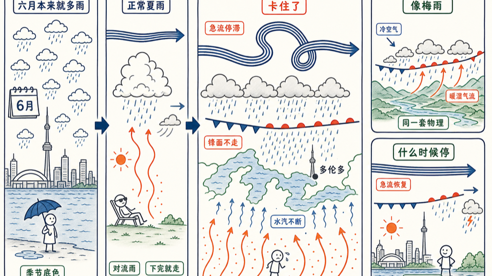

多伦多今年的雨，多得反常。

不是南方梅雨那种连下一个月不停的下法，而是隔三差五就来一场，累计下来，雨水明显比往年多——潮、闷，晾的衣服干得慢，体感像到了南方。

我忍不住去查了查：今年到底怎么了？

## 六月多雨不稀奇，反常的是「偏多」

先说清楚：多伦多的六月，本来就不算干。

常年平均下来，这个月有二十来个或多或少见雨的日子，降水量逼近一百毫米——雷阵雨是夏天常客，说来就来。所以「六月会下雨」一点不奇怪。

但今年的问题是量。系统一波接一波地过境，雨水累计起来，明显超出常年的水平。不是某一场特别猛，是整体偏多——这才是反常的地方。

而且这不是六月才开始的。四、五月的雨水就已经偏多，从春天一路湿到入夏，连着几个月都压在常年线之上。正是这一整段连续的偏湿，才说明它不是某一个月的偶然，而是今年的天气格局出了偏差。

## 为什么今年偏多

一年比常年湿，通常不是单一原因，而是几样凑到了一起。

一是过境的天气系统偏勤。高空那条急流像一条传送带，决定了风暴往哪走、来得多密。今年它摆出的形状，恰好让一个个系统接连从五大湖上空碾过，下雨的机会就比平常多。

二是水汽足。南方的暖湿气流一路往北送，再叠上五大湖自己蒸腾的湿气，等于给这些系统接了根水管。水汽越足，每一场下得越透，累计自然往上冲。

三是这种偏湿的格局一旦立住，往往能赖上一整季——不是天天下，是这个夏天的底色被调湿了。

还有一层更大的背景不能不提：大气越暖，能兜住的水汽就越多，温度每升高一点，空气的「含水量」上限就抬高一截。这不直接决定某一年下多少雨，但它让「偏湿的年份」更容易下得更狠。今年是不是这条趋势上的一个点，得拉长了时间才说得准——单独一年的反常，还不足以下结论。

## 「像南方」不是错觉

你觉得今年的多伦多潮得像南方，真不是错觉。

南方的湿，是暖湿气流常年顶在头上；多伦多今年的湿，是急流和水汽凑巧把这套配置搬到了更高的纬度。成因不完全一样，体感却像——空气里那股黏糊糊、晾不干的劲儿，是一样的。

## 什么时候能干爽

得等高空环流换个形状。

那条传送带迟早会调整，把风暴的路径甩到别处，水汽的水管拧小，多伦多才会切回它该有的夏天：热、晒、偶尔一场痛快的雷雨，下完就晴。

在那之前，伞还是随身带着吧。

## 参考资料

- [Toronto June weather（climate-data.org）](https://en.climate-data.org/north-america/canada/ontario/toronto-53/t/june-6/)
- [Tomorrow's Weather Toronto — The Weather Network](https://www.theweathernetwork.com/en/news/weather/local-forecasts/toronto-on-weather-forecast-14-june)

如有错误或不严谨之处，欢迎评论区指正。
