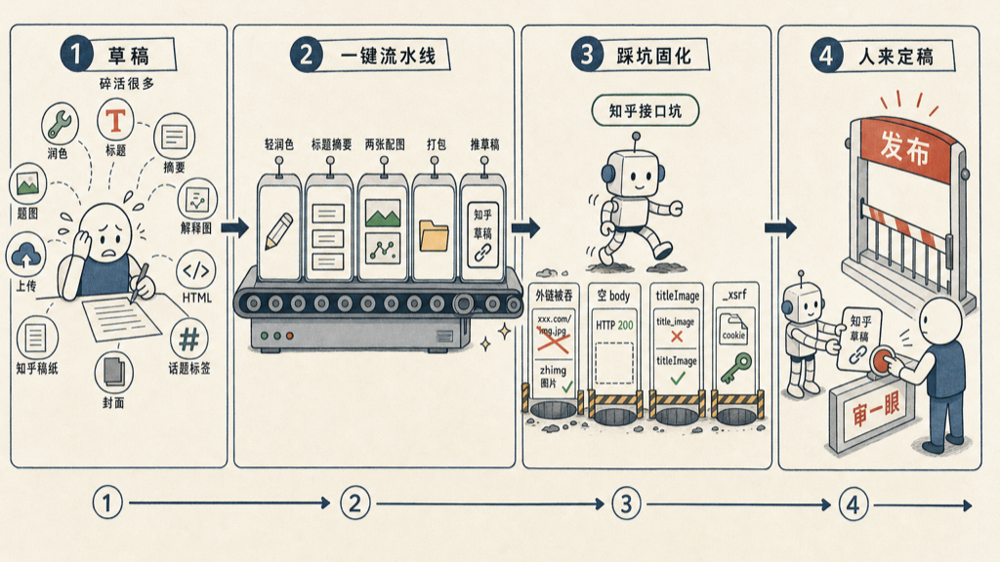

我写了个 skill，发知乎这件事，现在一条命令就够了。

给他一段草稿，他轻润色、起标题、写摘要、生成一张题图加一张解释图、把图传上知乎图床、转成知乎要的 HTML、建好草稿——我只需要最后看一眼，点发布。

## 为什么要做这个

发一篇知乎，写完正文只是开头。后面那一串碎活才烦：润色一遍、配张题图、再画张解释图、把图传到能用的图床、把 markdown 转成知乎认的格式、登录、建草稿、填封面、选话题。

每一步都不难，但每一步都要切换、都要手动、都打断思路。一篇文章的正文可能写半小时，这些碎活能再耗你半小时。

我想要的是：写完草稿，剩下的交给他。

## 一键做了什么

整条流水线是这样的：

- **轻润色**——只修错字、调分段、抚平拗口的句子。不重写、不加 AI 腔、不动我的语气。改超过原文 5% 就算改多了，退回去。
- **标题和摘要**——给三个标题候选，一个直白、一个故事、一个挑原文里最有味道的句子；再写一条五十到八十字的摘要。
- **两张配图**——题图严格 2.35:1，强字体、强构图；解释图扁平卡通、带标签和流程，画完就近插在最相关的段落后面，不堆文末。
- **打包**——article.md、两张图、meta.json、原始输入，归到一个带日期的文件夹里。
- **推草稿**——转 HTML、传图、建知乎草稿，回我一个草稿链接。

配图我是调 OpenAI 的 gpt-image-2 图像模型来画的。给它一段长长的设计原则当 instructions，再给一句生成指令，它把概念图吐出来，题图再裁到知乎封面的比例。一句话的事，不用我开 Figma。

## 然后我踩了一路知乎的坑

真正费时间的不是写流水线，是知乎的接口一个个不按常理出牌。

**第一个坑：图传上去，知乎给我吞了。** 一开始我图省事，把配图传 imgur，拿公开链接塞进正文。建草稿成功，一打开——图全没了。试了半天才反应过来：知乎保存正文时，会静默删掉所有不是它自己 CDN（zhimg.com）的图片外链。imgur、随便哪个图床，一律剥掉，连个报错都不给。

解法是老老实实走知乎自己的图床：先 `POST api.zhihu.com/images` 拿一个上传 token，把图片 PUT 到它背后的阿里云 OSS 桶，再用 `picx.zhimg.com` 的链接塞进正文。知乎认得这个 object key，图就留下了。

**第二个坑：成功了，但脚本以为失败。** 写正文的接口（PATCH）跑完，返回一个 HTTP 200，body 却是空的。我的脚本等着解析 JSON，一看空的就报错退出。查了才知道：知乎只有建草稿那一步的 POST 会回 JSON，后面写正文、发布这些 PATCH / PUT，成功就是 200 加空 body。把「2xx 且空 body」也当成功，问题就没了。

**第三个坑：封面死活设不上。** 我对着草稿接口写 `title_image` 字段，怎么填都不生效，取回来永远是空。换着花样试了一圈，最后发现写入键是驼峰的 `titleImage`——下划线那个 `title_image` 是只读的输出字段，你写它等于对着墙说话。

**第四个坑：401。** 只配了 `z_c0` 这一个 token，建草稿能成，一到写正文就 401。知乎的写接口还要一个 `_xsrf`。最稳的办法是把浏览器里整条 cookie 复制下来，脚本自己从里面抽 `_xsrf` 填进请求头。

这些坑都不大，但每一个都能卡你一两个小时。写进 skill 之后，它们就再也不用我操心了——这本来就是 skill 该干的事：把一次性踩明白的坑，固化成下次不用再踩。

## 用起来就一句话

真用的时候，我把草稿粘进去，说一句「写篇文章发知乎」。

它就开始跑：先把润色的几处改动列给我看——改了哪个错字、哪段拆开了——我点头，它接着生成三个标题候选和两张图，打成一个带日期的文件夹，再推一个草稿到知乎，把链接甩给我。

我点开链接，扫一眼排版和配图。要改就改文件夹里的 `article.md`、或换张图，再让它重跑——它记得草稿 id，原地更新同一篇，不会建出一堆重复草稿。满意了，我说一声「发」，它才真的发布。

从一段草稿，到一篇排好版、配好图、设好封面的知乎文章，全程我敲的字没超过三句话。

## 有一道闸我故意留给人

整条流水线全自动，但我在最后留了一道人工闸：默认只建草稿，绝不一步发布。

哪怕我嘴上说「发布」，它第一次也只更新草稿，把链接给我，让我在知乎上亲眼看一遍——题图正不正、配图插得对不对、话题选没选——确认了，才真的发出去。

道理跟「别让写代码的 agent 自己判断代码行不行」是一样的。生成的那个再聪明，也不该自己按下那个不可逆的按钮。机器可以把活干到 99%，但最后那一眼、那一下，留给人。

一键不是把人挤出去，是把人从碎活里捞出来，只留在最该在的地方：审一眼，点发布。其余的，交给他。

## 后注

这 skill 现在还只在我自己的库里跑，风格、配图的比例、润色的尺度都还在调。但主干已经顺了——从一段草稿到一个知乎草稿，中间我不用碰第二个工具。

如有错误或不严谨之处，欢迎评论区指正。
