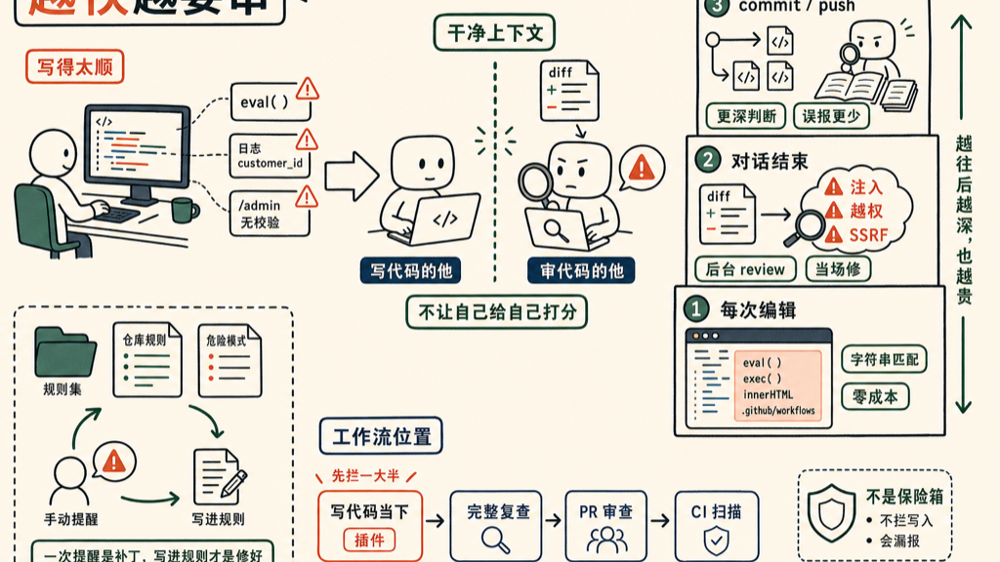

AI 写代码越快，越要做 security review。

这不是给他泼冷水。是因为他写得太顺了——语法对、跑得通、看着专业，可 `eval` 一个用户输入、把 `customer_id` 打进日志、`/admin` 路由忘了校验角色，这些洞他一样写得理直气壮。人快速扫一遍很难逮住，因为代码「看起来都对」。

过去的做法是把 security review 全压到下游：等代码进了 PR 让人审，或者上了 CI 让扫描器扫。问题是越往后越贵。一个注入漏洞，在编辑器里改是一行，进了 PR 是一轮 review，上了线是一次事故。

Claude Code 现在有个官方插件 `security-guidance`，把这道关提前到他写代码的当下——他写，另一个干净上下文的他来审，当场修。装好之后全自动，没有命令要记，没有东西要触发。下面把三件事说清楚：何时用、怎么用、怎么塞进你自己的工作流。

## 核心设计：不让写代码的他给自己打分

这点是整个插件最聪明的地方。

审代码的，不是写代码那个他。每次编辑那层是纯字符串匹配，根本没有模型参与；对话结束和 commit 那两层，是**另起一个干净上下文**的 Claude，只拿到 diff，对原来的写法没有任何感情，prompt 只让他干一件事——挑毛病。

自己审自己永远手软。让一个没投入感、没立场的他来挑刺，才挑得动。这跟你不会让作者自己校对自己的稿子、不会让开发自己测自己的功能，是一个道理。

## 三层检查，深度递增



插件在三个时机审他的活，一层比一层深：

| 时机 | 做什么 | 成本 |
|------|--------|------|
| 每次文件编辑 | 字符串匹配危险调用，无模型调用 | 零 |
| 每轮对话结束 | 后台模型 review 这轮所有改动的 diff | 一次模型调用 |
| 每次他 commit / push | 更深的 agentic review，读周边代码再判断 | 多轮，每小时限 20 次 |

**每次编辑**这层逮的是肉眼可见的危险调用：`eval(`、`new Function`、`os.system`、`child_process.exec`、`pickle`、`dangerouslySetInnerHTML`、`.innerHTML =`、`document.write`，还有动 `.github/workflows/` 的改动（这能改仓库权限）。纯字符串匹配，零成本，写完就提醒。

**每轮对话结束**这层逮的是字符串匹配看不出来的：授权绕过、IDOR（不安全的直接对象引用）、注入、SSRF、弱加密。它在后台跑，不拖慢他回你话；发现问题就把 findings 喂回去，让他当场修。

**每次 commit / push** 这层最深，是 agentic 的——他会去读调用方、读 sanitizer、读相关文件，判断这个洞在你这套代码里到底是不是真的。多读这些上下文，是为了把误报压下去：很多调用孤立看着危险，放进你的代码其实是安全的。

对着 OWASP Top 10 几乎一一对得上——注入、失效的访问控制、加密失败、SSRF，都在它管的范围里。

一个必须记住的边界：**三层都不拦写入、不拦提交。** findings 是作为指令喂回给写代码的他，他在对话里修，而且审的模型也会漏。它是 defense in depth 的一层，不是全部，别把它当成保险箱。

## 何时用

直接说：

- 写后端、写处理用户输入的、写涉及权限和数据的代码——**必开**。
- 纯前端样式、跑一次性数据脚本、写文档——可不开，但开着也无妨，每次编辑那层零成本。

一个硬前提：得在 git repo 里。对话结束和 commit 那两层靠 git diff 工作，不在 repo 里就静默跳过，只剩字符串匹配那层还在跑。

## 怎么装

在 Claude Code 会话里：

```text
/plugin install security-guidance@claude-plugins-official
/reload-plugins
```

装的时候选 **user scope**，每个新 session 自动加载。第一次跑会在 `~/.claude/security/` 建个 venv，装 Agent SDK，需要联网。要 Claude Code 2.1.144 以上、`PATH` 上有 Python 3.8+。

云端 session（Claude Code on web）带不进 user scope 的插件，团队想所有人都开也一样——这时写进项目的 `.claude/settings.json`：

```json
{
  "enabledPlugins": {
    "security-guidance@claude-plugins-official": true
  }
}
```

## 把你自己的规则喂给他

这是我最喜欢的部分。内置规则之外，你能加两种自己的规则，都是叠加的，加得上、删不掉内置的。

一、给模型 review 的指南，`.claude/claude-security-guidance.md`，用大白话写你这个仓库的威胁模型：

```markdown
- 不要在 INFO 级别以上打 customer_id 或 account_number。
- /admin 下所有路由，读库前必须先 require_role("admin")。
- token 比较用 crypto.timingSafeEqual，不要用 ===。
```

二、给「每次编辑」那层的字符串 / 正则规则，`.claude/security-patterns.yaml`：

```yaml
patterns:
  - rule_name: internal_api_key
    substrings: ["sk_live_", "AKIA"]
    reminder: "硬编码的密钥前缀。从 secret manager 取凭证。"
  - rule_name: tenant_unfiltered_query
    regex: "\\.objects\\.all\\(\\)"
    paths: ["**/src/tenants/**"]
    reminder: "多租户代码必须按 org_id 过滤。"
```

为什么这一步比什么都重要？因为**对话里纠正他一次，只修这一回；写进规则，才修所有未来**。你每次手动提醒他「别把密钥写死」「这张表要按租户过滤」，是补丁，下回新开对话他照样犯。写进 `claude-security-guidance.md` 和 `security-patterns.yaml`，才是把这个洞一次性堵死。一个是 patch，一个是 fix。

## 它在整个工作流里的位置

插件只是 defense in depth 的第一层，逮得最早，但不是终点。一套典型的栈长这样：

| 阶段 | 工具 | 管什么 |
|------|------|--------|
| 写代码当下 | `security-guidance` 插件 | 他写的常见漏洞，当场修 |
| 按需 | `/security-review` | 对当前分支跑一次完整 security pass |
| PR 时 | Code Review | 带全代码库上下文的多 agent 审查 |
| CI | 你现有的静态扫描 / 依赖扫描 | 语言规则、供应链、策略 |

每一层逮住前一层漏的。插件的价值，是把到达后面几层的量压下来，不是取代它们。所以正确的用法不是「装了插件就不审了」，而是反过来——插件在最前面拦掉一大半显而易见的，让后面的人和 CI 去对付真正难的。

回到开头那句：AI 写代码越快，越要做 security review。他给了你十倍的速度，你得用同样的速度把关跟上。把审查提前到他写的当下，是目前我见过性价比最高的一道关。

## 参考资料

- [Catch security issues as Claude writes code](https://code.claude.com/docs/en/security-guidance)
- [Code Review](https://code.claude.com/docs/en/code-review)

如有错误，欢迎评论区指正。
