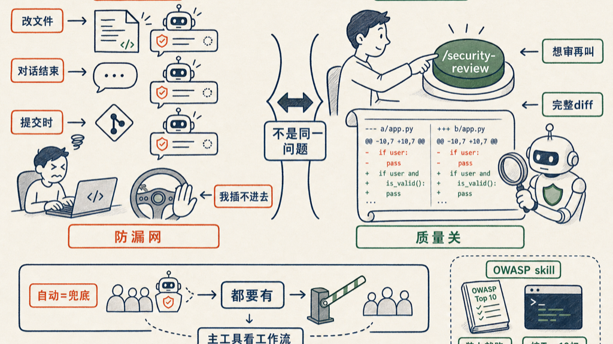

试了 Claude Code 的 security-guidance 插件，结论是和我的工作流合不上，最后没用它。

插件是 hooks 驱动的，在三个时机自动审：文件编辑时、对话结束时、commit 时。自动是自动了，但问题也在这里——我插不进去。我没办法告诉他「只审这次改的这个函数」。触发时机是系统决定的，我只能被动接受。

我想要的逻辑不是这个。我想的是：觉得这块有风险，叫他来审；不叫，他就别动。**能控制它什么时候动，才是质量关。** hooks 的模型反过来——他什么时候来，不是我说的算。

最后选了 `/security-review`。显式调用，随时可以触发，审的是当前分支的完整 diff。这才是我要的那道门。

---

今天还发现了两个社区做的 OWASP skill，不是官方出的，但挺好用：

- [agamm/claude-code-owasp](https://github.com/agamm/claude-code-owasp/tree/main/.claude/skills/owasp-security)
- [afiqiqmal/claude-security-audit](https://github.com/afiqiqmal/claude-security-audit)

两个都能扫你的代码，按 OWASP Top 10（2025/2026 版）生成报告。就是个 skill 加一条命令，装上就跑，用起来很顺手。有时候就想对着 OWASP 清单过一遍，这种工具正好。

---

这让我想清楚了一件事：全自动的安全扫描和显式触发的，解决的不是同一个问题。

全自动是防漏网——你忘了，他帮你兜。这有价值，尤其在大团队里，不能假设每个人都会主动去审。

显式调用是质量关——你知道这块要认真，你叫他来。主动权在你。

两者都要有，但选哪个作为主工具，取决于你受不受得了被 hooks 打断。对我来说，接受不了。`/security-review` 用着更对。

## 参考资料

- [claude-code-owasp](https://github.com/agamm/claude-code-owasp/tree/main/.claude/skills/owasp-security)
- [claude-security-audit](https://github.com/afiqiqmal/claude-security-audit)

如有错误，欢迎评论区指正。
