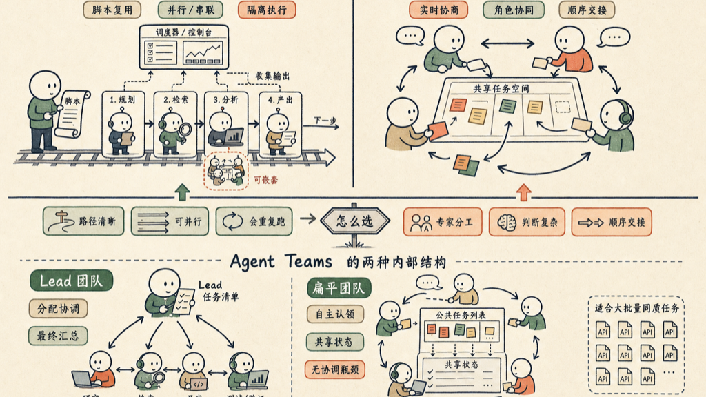

Claude Code 里，多个 agent 协作有两种路线。选错了，效率减半。

## Dynamic Workflow 和 Agent Teams，区别在哪？

Dynamic Workflow 是确定性的调度框架。你写一个脚本，把一批相互隔离的 agent 串起来跑。每个 agent 只看自己分到的输入，不知道其他 agent 在干什么。框架控制流程、收集输出、决定下一步。

**这个结构的核心优势是可重复：你把脚本存下来，下次同类任务，一行命令直接复用。**

Agent Teams 则是一小组 agent，彼此感知、实时协商、互相交接任务。他们活在共同的任务空间里，可以根据对方的输出调整策略。

这不是流水线，是协作。

## 怎么选？

四条规则：

- 任务探索性强、路径未知 → Dynamic Workflow
- 需要专家角色协同、判断复杂 → Agent Teams
- 任务可并行、你会反复跑 → Dynamic Workflow（存下脚本）
- 流水线作业、需要顺序交接 → Agent Teams

两种模式不互斥。一个 Dynamic Workflow 的某个节点，完全可以是一个 Agent Team 在做。

## Agent Teams 必须有 Lead 吗？

官方默认结构有 lead：一个 session 充当 team lead，负责分配任务、协调进度、最后汇总结果。其他 teammate 各自在独立 context window 里工作，可以互相直接通信。你对 Claude 说「创建一个 agent team」，他默认就建这个结构——一个 lead 加若干 teammate。

但还有扁平结构，没有 orchestrator。

所有 agent 从一个公共任务列表里自主认领工作。谁空谁拿，做完更新共享状态，自然形成负载均衡。

**这个模式适合大批量、高度同质的任务：迁移 40 个 API 端点，给几十个文件补测试，扫描整个代码库的某类问题。**

没有 lead 需要协调，也就没有协调瓶颈。

## 一句话决策

路径清晰、可并行、会重复跑 → Dynamic Workflow。角色分工、专家协商、顺序交接 → Agent Teams。两者可以嵌套，混用才是真正的生产力。
