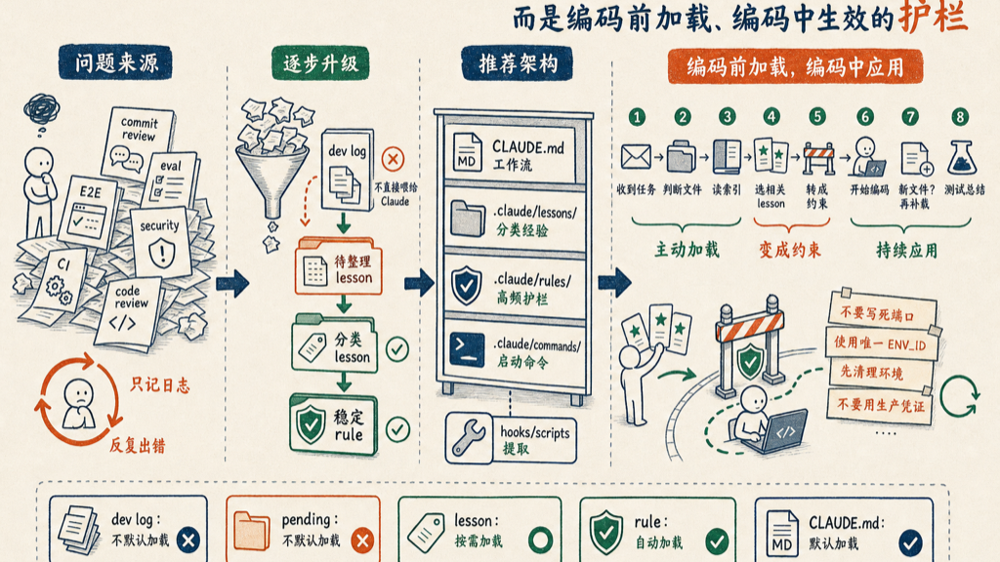

## 1. 背景

在 Claude Code / AI coding agent 的开发流程中，每次 commit code、eval code、review code 之后，团队通常会产生一些 lesson。

这些 lesson 可能来自：

- commit review 失败
- eval code 失败
- E2E 测试失败
- security review 发现问题
- agent 重复犯错
- CI/CD 失败
- 人工 code review feedback

如果这些 lesson 只保存在 dev log 里，Claude Code 在下一次编程时不会主动使用它们。这样会导致同样的问题反复出现。

因此，lesson 不应该只是历史记录，也不应该只是最后 commit 前检查的 checklist。

真正目标是：

> 以前的 lesson 要在本次编程过程中主动变成 coding guidance，提前约束 agent，防止他再次犯同样错误。

---

## 2. 核心原则

不要把所有 lesson log 直接塞进 `CLAUDE.md`。

原因：

- `CLAUDE.md` 会越来越长
- 每次启动都会浪费 context
- 很多 lesson 和当前任务无关
- 旧 lesson 可能干扰当前判断
- Claude Code 可能被历史 log 污染

正确做法是：

```text
CLAUDE.md = lesson-guided workflow 规则
.claude/lessons/ = 分类后的 lesson 知识库
.claude/rules/ = 高频、稳定、必须遵守的 coding guardrails
.claude/commands/ = 手动触发 lesson-guided workflow 的命令
```

也就是说：

> `CLAUDE.md` 不存放全部 lesson 内容，只定义 Claude Code 应该如何在编程前和编程中使用 lesson。

---

## 3. 推荐目录结构

```text
project/
  CLAUDE.md
  .claude/
    lessons/
      index.md
      pending-lessons.md
      security-lessons.md
      e2e-lessons.md
      spring-boot-lessons.md
      commit-lessons.md
    rules/
      spring.md
      security.md
      e2e.md
    commands/
      start-task.md
      apply-lessons.md
    hooks/
      extract-lessons.sh
  dev/
    logs/
      commit-logs/
      eval-logs/
      review-logs/
```

---

## 4. Lesson 的生命周期

推荐把 lesson 从原始 log 逐步升级：

```text
dev log
  ↓
extracted lesson
  ↓
.claude/lessons/pending-lessons.md
  ↓
reusable categorized lesson
  ↓
.claude/lessons/<category>-lessons.md
  ↓
stable repeated lesson
  ↓
.claude/rules/<path-scoped-rule>.md
```

含义：

- 原始 dev log 不直接进入 Claude context
- 先提炼成短 lesson
- 分类保存
- 多次重复出现的重要 lesson 升级为 rule
- rule 可以按路径自动触发

---

## 5. CLAUDE.md 应该怎么写

`CLAUDE.md` 中建议加入以下内容：

```md
## Lesson-Guided Development

Past lessons from commit/eval logs are active coding guidance, not post-commit notes.

Before editing code:
1. Inspect the task and likely impacted files.
2. Read `.claude/lessons/index.md`.
3. Load only lessons whose `Trigger` or `Applies to` match the current task.
4. Convert those lessons into concrete constraints for this task.
5. Follow those constraints while coding.

During coding:
- If new touched files match another lesson category, load that lesson before continuing.
- Repeated or high-confidence lessons should be treated as guardrails.
- If a lesson is outdated or conflicts with current tests/code, verify before applying.

Do not wait until final review to check lessons.
Lessons must influence implementation decisions before code is written.
```

这段的核心含义是：

```text
不是写完代码再检查 lesson
而是开始写代码前先加载相关 lesson
并在 coding 中持续应用
```

---

## 6. Lesson Index 设计

创建 `.claude/lessons/index.md`，示例内容：

```md
# Lesson Index

## Security Lessons
File: `.claude/lessons/security-lessons.md`

Use when:
- touching authentication or authorization
- changing JWT/session logic
- modifying Spring Security config
- handling secrets, tokens, passwords, or credentials
- changing logging of sensitive data

## E2E Lessons
File: `.claude/lessons/e2e-lessons.md`

Use when:
- editing Playwright tests
- changing Docker Compose E2E setup
- changing test data or seed scripts
- debugging CI E2E failures
- creating temporary agent test environments

## Spring Boot Lessons
File: `.claude/lessons/spring-boot-lessons.md`

Use when:
- editing controllers, services, repositories, entities
- changing Spring Data JPA logic
- modifying transaction boundaries
- changing validation or DTO mapping

## Commit / Eval Lessons
File: `.claude/lessons/commit-lessons.md`

Use when:
- preparing code changes
- checking recurring implementation mistakes
- responding to failed evals
- fixing repeated review comments
```

Claude Code 先读 index，再决定加载哪些 lesson 文件。

---

## 7. Lesson 文件格式

Lesson 不应该写成长篇回忆，而应该写成可执行的 coding guidance。

### 不推荐的写法

```md
Last time the agent forgot to clean up Docker containers and the E2E test failed.
```

### 推荐的写法

```md
## LESSON-E2E-001: Always clean isolated E2E environment

Category: e2e

Applies to:
- `docker-compose.e2e.yml`
- `scripts/e2e-*`
- `playwright.config.ts`
- `tests/e2e/**`

Trigger:
When creating, editing, or running E2E tests.

Guidance:
- Always use a unique `ENV_ID`.
- Always clean up with `docker compose down -v --remove-orphans`.
- Use `trap cleanup EXIT` in scripts.
- Do not hardcode shared localhost ports.
- Do not reuse another agent's test environment.

Failure prevented:
- flaky E2E tests
- port conflicts
- stale database state
- polluted Docker volumes
```

这个格式能让 Claude Code 在实际 coding 时直接应用。

---

## 8. 把高频 Lesson 升级成 `.claude/rules/`

如果某个 lesson 经常适用，而且已经被证明稳定、正确，就应该从 lesson 升级成 rule。

例如 `.claude/rules/e2e.md`：

```md
---
paths:
  - "docker-compose*.yml"
  - "scripts/e2e-*"
  - "playwright.config.*"
  - "tests/e2e/**"
---

# E2E Coding Guardrails

- Use isolated temporary environments for AI-agent E2E tests.
- Use unique `ENV_ID` for each run.
- Do not hardcode localhost ports.
- Read assigned Docker ports dynamically.
- Always clean up with `docker compose down -v --remove-orphans`.
- Use sandbox or WireMock for external services.
- Do not point E2E tests at production.
```

这样当 Claude Code 修改 E2E 相关文件时，规则会按路径自动加载。

---

## 9. Start Task Command

为了让 lesson 在 coding 前生效，可以创建一个自定义 command。

创建 `.claude/commands/start-task.md`：

```md
Start this coding task using lesson-guided workflow.

Steps:
1. Understand the task.
2. Inspect likely impacted files.
3. Read `.claude/lessons/index.md`.
4. Select only lessons whose `Trigger` or `Applies to` match the task/files.
5. Summarize the active lessons as concrete constraints before editing.
6. Implement the task following those constraints.
7. If new files become relevant, check whether additional lessons apply.
8. Before final response, mention any relevant lessons that influenced the implementation.
```

使用方式：在任务开始时告诉 Claude Code：

```text
Use lesson-guided workflow for this task.
```

或者直接运行 `/project:start-task`。

---

## 10. Coding 前的理想流程

```text
User gives task
        ↓
Claude inspects likely impacted files
        ↓
Claude reads `.claude/lessons/index.md`
        ↓
Claude selects relevant lesson files
        ↓
Claude converts lessons into active constraints
        ↓
Claude edits code under those constraints
        ↓
If new file area appears, Claude checks additional lessons
        ↓
Claude runs tests/checks
        ↓
Claude summarizes changes and applied lessons
```

这个流程可以避免 lesson 只在最后 review 时才出现。



---

## 11. Coding 中如何应用 Lesson

Claude Code 在 coding 中应该做到：

```text
如果正在改 security 文件 → 加载 security lessons
如果正在改 E2E 文件 → 加载 e2e lessons
如果正在改 Spring Data JPA → 加载 spring-boot lessons
如果准备 commit → 加载 commit/eval lessons
```

Lesson 应该变成当前任务的约束，例如：

```text
Active constraints for this task:
1. Do not hardcode E2E ports.
2. Use dynamic Docker Compose project name.
3. Add cleanup trap for temporary environment.
4. Do not use production credentials.
5. Preserve existing Spring Boot package structure.
```

Claude Code 再基于这些 constraints 写代码。

---

## 12. Hook 的作用

Hook 可以用来提取 lesson，但不建议让 hook 每次自动加载全部 lesson。

例如 commit/eval 后，把新 lesson 追加到 `.claude/lessons/pending-lessons.md`：

```bash
./scripts/extract-lessons-from-dev-log.sh >> .claude/lessons/pending-lessons.md
```

然后定期整理：

```text
Read pending lessons, deduplicate them, and merge only reusable lessons into the correct lesson files. Keep each lesson short and actionable.
```

Hook 适合做：

- 提取 lesson
- 保存 review feedback
- 记录 eval failure
- 生成 pending lesson

Hook 不适合做：

- 每次都把所有历史 log 加载进 context
- 把 CLAUDE.md 越写越长
- 让旧 lesson 无条件影响所有任务

---

## 13. Dev Log vs Lesson vs Rule

| 类型 | 作用 | 是否默认加载 |
|---|---|---|
| dev log | 原始记录 | 否 |
| pending lesson | 尚未整理的经验 | 否 |
| categorized lesson | 可复用经验 | 按需加载 |
| rule | 高频稳定约束 | 按路径自动加载 |
| CLAUDE.md | 工作流和索引规则 | 是 |

最重要的原则：

```text
原始 log 不直接喂给 Claude。
只有提炼后的 lesson 才进入 coding guidance。
高频 lesson 升级为 rule。
```

---

## 14. 推荐落地方式

### Phase 1：先建立 lesson-guided workflow

- 在 `CLAUDE.md` 中加入 Lesson-Guided Development 规则
- 创建 `.claude/lessons/index.md`
- 创建几个分类 lesson 文件

### Phase 2：整理历史 lesson

- 从 dev log 中提取 recurring mistakes
- 删除一次性、不重要、过时的内容
- 每条 lesson 改写成 `Trigger / Applies to / Guidance / Failure prevented`

### Phase 3：升级高频 lesson 为 rule

- E2E 规则放到 `.claude/rules/e2e.md`
- Security 规则放到 `.claude/rules/security.md`
- Spring Boot 规则放到 `.claude/rules/spring.md`

### Phase 4：添加 command

- 创建 `.claude/commands/start-task.md`
- 要求每次 coding task 开始前运行 lesson-guided workflow

---

## 15. 总结

目标不是简单引用 dev log，也不是让 `CLAUDE.md` 保存所有 lesson。

真正目标是：

```text
让以前的 lesson 在本次 coding 前被加载，
在 coding 中变成 active guardrails，
提前防止 agent 重复犯错。
```

推荐架构：

```text
CLAUDE.md
  → 定义 Lesson-Guided Development 工作流

.claude/lessons/
  → 存放分类后的可复用 lesson

.claude/rules/
  → 存放高频、稳定、按路径触发的 guardrails

.claude/commands/start-task.md
  → 每次 coding 前主动加载相关 lesson

hooks/scripts
  → 从 commit/eval/dev log 中提取 pending lessons
```

> **Lesson 不应该只是最后 check，它应该在 coding 前被加载，并在 coding 中变成 active guidance。**
