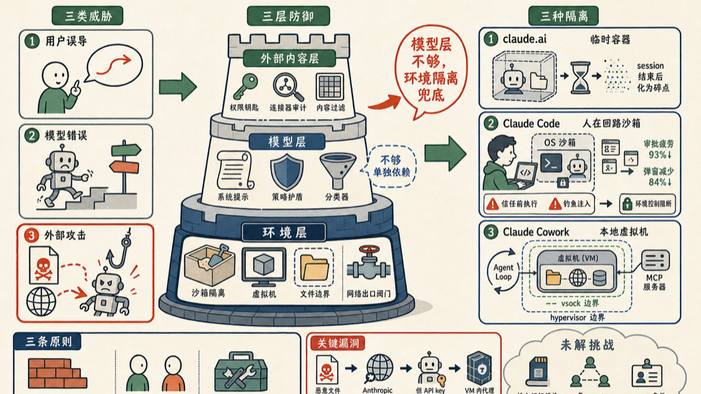

Anthropic 发了一篇工程博客，讲他们怎么在三个产品里控制 Claude。读完我觉得，整篇文章说的最重要的事只有一句话：**靠模型层防御是不够的，环境隔离才是真正能兜底的东西。**

这个结论听起来平淡，但背后有大量真实踩坑。让我来拆一下。

## 三类威胁

Anthropic 把威胁分成三类：

- **用户误导**：用户有意或无意地让 Claude 做坏事
- **模型错误**：Claude 自己走错路，触发意外后果
- **外部攻击**：通过工具、文件、网络访问或 prompt 注入

这三类里，最难防的是第三类。因为你无法控制 Claude 会读到什么内容。

## 三层防御

面对这三类威胁，Anthropic 用三层来防：

| 层 | 手段 |
|---|---|
| 环境层 | 沙箱、虚拟机、文件系统边界、出口流量控制 |
| 模型层 | 系统提示、分类器、训练修改 |
| 外部内容层 | 工具权限、连接器审计、内容过滤 |

**他们明确说了：模型层单独用是不够的。** 哪怕模型防御做得很强，也不可能 100% 有效，不能只靠它。

## 三个产品，三种隔离

这是文章最有意思的部分——针对不同用户群体，隔离策略完全不一样。

### claude.ai：临时容器

用 gVisor 容器，每个 session 有独立的临时文件系统，session 结束就销毁。爆炸半径小，但能力也受限。这是为普通用户设计的，他们需要的是简单、安全。

### Claude Code：人在回路的沙箱

Claude Code 跑在用户自己的机器上，能访问文件系统和 shell。这里有个有趣的发现：

最初的设计要求用户对每个危险操作手动审批。结果他们发现，用户审批率高达 **93%**——几乎所有弹出来的东西都点了确认。这就是典型的"审批疲劳"。

解法是 OS 级沙箱（macOS 用 Seatbelt，Linux 用 bubblewrap），把权限弹窗减少了 **84%**，只有真正需要用户决策的时候才弹。

但更关键的发现是两个漏洞：

**漏洞 1：信任提示之前的代码执行**

项目配置文件会在安全提示弹出之前就被解析和执行。攻击者可以在用户还没点"我信任这个仓库"之前，就通过 hook 执行恶意代码。修法：把项目级配置的解析和执行，推迟到用户接受信任提示之后。

**漏洞 2：钓鱼攻击**

内部测试发现，用户可以被骗去运行含有数据外泄命令的注入 prompt。这里有一句话我觉得非常关键：**"模型层帮不上忙——对他来说没有任何异常迹象可以捕捉。"**

从 Claude 的视角看，那是一个完全正常的请求。只有环境控制才能阻止这件事发生。

### Claude Cowork：本地虚拟机

面向非技术用户，用完整虚拟机隔离。最初把整个 agent loop 放进虚拟机里跑，后来因为可靠性问题，改成 agent loop 在虚拟机外，虚拟机负责文件系统和网络控制。本地 MCP 服务器也移到虚拟机外面，方便审计和监控。

设计上有个细节：**即使虚拟机被 root 级攻破，还有两层机制能继续工作**（hypervisor 边界和 vsock 边界）。防御是分层的，没有单点。

## 一个出乎意料的漏洞

文章里我印象最深的一个案例：

攻击者构造了一个恶意工作区文件，指示 Claude 用攻击者提供的 API key 去调用 Anthropic 的 Files API。出口代理检查了目标地址（确实是 Anthropic 的域名，通过了），但没有发现能力被滥用了。

修法是在虚拟机内部加了一个防御性的中间人代理，拦截所有发往 API 的流量再做二次审查。

这个案例说明：**审批了目标不等于审批了行为。** 你以为控制了"去哪里"，但攻击者可以控制"带什么去"。

## 几个原则

文章总结了三条原则：

1. **优先环境隔离**：硬边界比概率性的模型防御更可靠
2. **隔离策略要匹配用户能力**：开发者和普通知识工作者需要不同的隔离方式
3. **不信任自研组件**：成熟的 hypervisor 和 syscall 过滤器，比自己写的安全层更靠谱

第三条我觉得特别有自知之明。Anthropic 在说：我们自己写的东西不一定比成熟的基础设施更安全，优先用已经经过大量检验的组件。

## 还没解决的问题

文章也提到了几个还在悬着的挑战：

- **持久内存污染**：session 状态越来越多（产品记忆、挂载的工作区），给 prompt 注入提供了越来越大的攻击面
- **多 agent 信任升级**：sub-agent 的输出被当成比原始工具结果更可信的东西，这个假设可能被利用
- **agent 身份问题**：agent 到底应该继承用户权限，还是有自己独立的身份主体？

这些还没有答案，但能提出来本身就是很有价值的事。

## 我的看法

这篇文章对我来说最大的收获：**不要期待模型训练能解决所有安全问题。**

Claude 足够聪明，能做很多事。但正因为他足够聪明，他也能被骗——而且有时候被骗了他自己都不知道。这时候只有环境控制才能兜底。

这跟软件工程里的最小权限原则是一个道理：不要靠"我相信这段代码不会出错"，而是靠"就算它出错，也做不了太多"。

## 参考资料

- [How We Contain Claude](https://www.anthropic.com/engineering/how-we-contain-claude)
