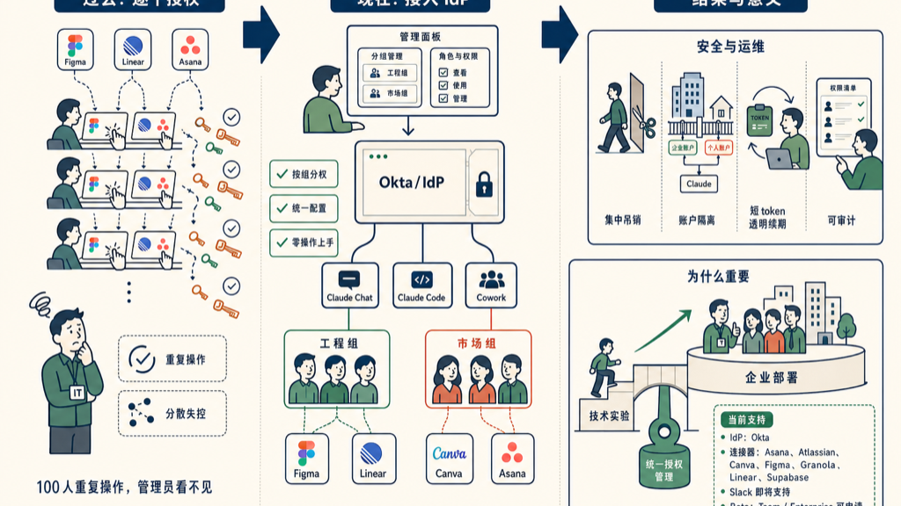

Anthropic 今天发布了企业级 MCP 连接器统一授权管理，这对于要给整个公司部署 AI 工具的 IT 管理员来说是个很实际的更新。

以前的问题很明确。每个员工登录 Claude 之后，要手动授权每一个 MCP 连接器——Figma、Linear、Asana，一个一个点。100 人的公司，就是 100 次重复操作。更麻烦的是，授权状态分散在每个人那里，管理员看不见、控不了。

现在的方案是把 MCP 连接器的授权接进 Okta 这类 IdP（身份提供商）。员工登录就位，连接器权限跟着 IdP 里的分组和角色走，管理员统一配置，不用每个人单独操作。

## 具体能做什么

**零操作上手**：员工登录 Claude，连接器已经配好了。不用再找文档、不用自己点授权。Claude chat、Claude Code、Cowork 三个端保持一致。

**按组分权**：同一个 Okta 分组里的人自动拿到同一套连接器权限。工程师组接 Figma + Linear，市场组接 Canva + Asana，各管各的。

**集中吊销**：员工离职，在 IdP 里一操作，Claude 这边的连接器权限跟着撤。不会留下游离的授权悬在那里。

**个人与企业账户隔离**：管理员可以要求连接器只走企业 IdP 接入，防止员工把个人 Figma 账户误连到企业工作流里。这个看起来小，实际很重要——混用账户是数据泄漏的常见路径。

**缩短 token 有效期**：管理员可以设置更短的 access token 生命周期，而不影响员工正常使用。以前如果 token 过期频繁，员工体验太差，大家就倾向于用长期 token——这是个两难。现在 IdP 帮你透明续期，安全和体验就不用二选一了。

## 目前支持哪些

IdP 方面，现在只有 Okta，其他正在来的路上。

MCP 连接器这边，发布时支持：Asana、Atlassian、Canva、Figma、Granola、Linear、Supabase，Slack 快了。

已经在内测的企业有 HubSpot、Ramp、Webflow。

## 这件事为什么值得关注

这个功能本身不复杂，但它补上了企业部署 AI 工具时最烦的一个缺口。

大公司 IT 部门对「员工自己授权」有天然的警惕——谁授权了什么，有没有把公司数据连到个人账户，出事了怎么审计？这些问题以前在 Claude 这边都没有干净的答案。

接进 IdP 之后，这些问题就有了企业 IT 熟悉的解法。Okta 那套权限模型，IT 管理员用了很多年，流程成熟，内部合规也好交代。

更宏观一点：MCP 要真的进企业，这一步是必须的。今天 MCP 连接器的玩法更多是开发者自己折腾，企业级部署还是有门槛。统一授权管理是把 MCP 从「技术实验」推向「可运营产品」的关键基础设施之一。

现在还是 beta，Team 和 Enterprise 计划用户可以申请内测。

## 参考资料

- [Centrally Manage Authorization for MCP Connectors](https://claude.com/blog/enterprise-managed-auth)

如有错误，欢迎评论区指正。
