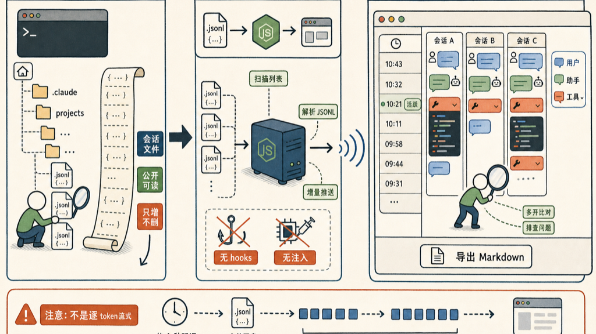

Claude Code 把每次对话都存成 JSONL 文件，路径是 `~/.claude/projects/<encoded-cwd>/<session-id>.jsonl`，只增不删，格式固定。这个文件是公开的，任何程序都能读。

我花了半小时，写了个工具来 tail 这些文件，在浏览器里实时展示——叫 [claude_output](https://github.com/gwang-indoc/claude_output)。

## 为什么做这个

用 Claude Code 时经常想回头看某个 session 里 Claude 说了什么、tool call 了什么参数、哪一步出了问题。CLI 里翻历史记录很麻烦，而且 Claude Code 自带的 session 管理不够直观。

浏览器里展示要方便很多。

## 怎么跑

```bash
git clone https://github.com/gwang-indoc/claude_output
npm install
npm start
```

打开 `http://127.0.0.1:4567` 就好了。

左侧边栏把你所有项目的 session 按时间排列，10 秒内被写过的 session 旁边有个绿点——这就是「正在活跃」的提示。点一个 session，右边开一块聊天面板：用户消息、助手回复、tool 调用各是一种气泡，代码有高亮，tool 内容可以折叠。可以同时开多个 session 放在一起比对。

有个 export：整个 session 可以导出成 Markdown，也可以勾选几条消息单独导出。

## 原理

没有 hooks，没有进程注入，就是 tail 文件：

```
~/.claude/projects/*/*.jsonl  →  Node.js (Express + WebSocket)  →  浏览器 (vanilla JS)
```

后端做三件事：扫描 session 列表、解析 JSONL 行、通过 WebSocket 把增量推到前端。前端渲染气泡。整个应用绑定在 127.0.0.1，只读，不会写任何东西到你的 session 文件里。



## 一个要说清楚的地方

**这不是逐 token 的流式显示。** Claude Code 把内容 flush 到磁盘，才会出现在浏览器里，大概有 1 秒延迟，输出也可能分块到来。是 tail，没办法比这更快了。

这个工具自己调试用比较顺手——看 Claude 在某个 session 里究竟做了什么，对着 tool call 的参数和结果排查问题。多开面板比对不同 session 也有用。

不算什么大工具，30 分钟写的，但用起来比翻 CLI 历史方便。开源，MIT，欢迎用。

## 参考资料

- [gwang-indoc/claude\_output](https://github.com/gwang-indoc/claude_output)

如有错误，欢迎评论区指正。
