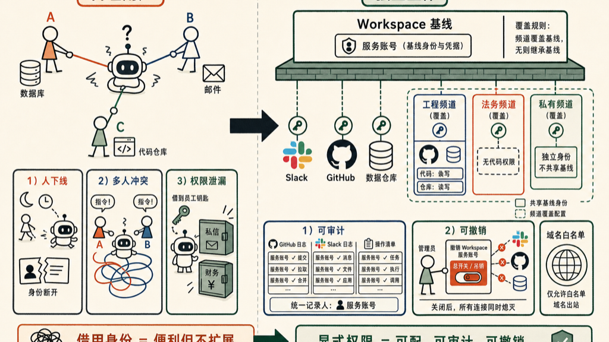

AI 应该用谁的权限做事？

这个问题，在 AI 只服务一个人的时候，不算问题。

但 AI 从"个人助手"变成"团队成员"这件事，发生得比大多数人意识到的要快。当一个团队里有十个人同时在指挥同一个 AI 助手，麻烦来了。

Anthropic 最近为 Claude Tag 发布了一套 agent identity access model，把这件事讲清楚了。

传统方案是让 AI **代理用户的权限**来操作——你登录了，AI 就用你的账号读文件、发消息、提 PR。单人场景里这很自然。但在多人团队里，这个模型有三个致命缺陷。

第一，AI 越来越多地在用户下线之后**自主运行**。定时触发、响应事件、异步任务——没有"当前用户"了，借谁的权限？

第二，多人同时指挥 AI 的时候，权限归属变得混乱。工程师 A 让 AI 去查数据库，销售 B 同时让 AI 发邮件——用谁的账号？

第三，最隐蔽的问题：如果 AI 用你的账号，那他能访问你能访问的一切。你能看私信，他就能看私信。你有财务文件的权限，他就有。这不是设计，是泄漏。

## AI 自己的服务账号

Anthropic 的 Claude Tag 在这件事上做了一个清晰的决断：**AI 用他自己的服务账号，不借任何人的身份。**

Claude 在 Slack 里发消息，显示的是"Claude app"，不是某个用户。接入 GitHub，用的是专门的 GitHub App 凭据。访问数据仓库，走独立的 service account。

这个设计的好处是直接的。权限变成了团队管理员可以显式配置的东西，而不是"谁叫我做事我就借谁的凭据"这种隐式传递。AI 做了什么、用什么身份做的，在每个系统里都有迹可查。

## 权限的层次结构

权限按两层走：workspace 基线 + channel 覆盖。

管理员在 workspace 层定义 Claude 的基线身份，所有频道都继承这个基线。需要特殊权限的频道，在频道层单独叠加。

工程频道需要访问 GitHub 和数据仓库？在那个频道的配置里加上。法务频道不应该看工程代码？法务频道的 Claude 身份就拿不到那个权限。**私有频道**拿到的是独立身份；公开频道共享 workspace 级别的身份。

这种设计让"谁能访问什么"变成可以被明确描述和审计的东西，而不是藏在员工账号里说不清楚的隐患。

## 审计与撤销

所有操作都记录在各系统自己的审计日志里——GitHub 的操作记录在 GitHub，Slack 的消息记录在 Slack，记录人是 Claude 的服务账号，而不是某个员工。

这个设计有一个很重要的好处：合规审计不再依赖员工口供或事后重建，每一个动作都挂在一个可以被追溯的身份下。

撤销也是一刀切：**吊销 workspace 的服务账号，Claude 在该工作区的所有访问立刻失效**。不需要逐个系统去撤销，也不需要担心某个员工离职后他的凭据还被 AI 用着。

出站流量限制在管理员批准的域名白名单内，这进一步压缩了 AI 误操作或被恶意指令带偏的攻击面。

## 从宽到窄，而不是从窄到宽

Claude Tag 的建议是：**先给宽松的权限，再根据审计日志收紧**。

这和传统安全建议里的"最小权限原则"听起来像是反的。但有道理：你不知道 AI 会被用来做什么，过于收紧的权限只会让团队绕开它、直接手工做——那样反而失去了审计覆盖。

先部署起来，看审计日志里实际发生了什么，再根据实际用途划定边界。这是实用主义，不是妥协。

## 这意味着什么

AI Agent 的权限模型，必须从"代理用户"走向"独立主体"。

不是因为 AI 特别聪明或特别危险，而是因为**团队软件从来就不是为单一用户设计的**。我们有角色、有权限、有审计——这些机制存在了几十年，AI 接入这些系统，自然也需要遵循同样的逻辑。

就像数据库不会因为每次查询都要借用 DBA 的账号才能运行，服务账号是运维里最基础的常识。AI Agent 晚了一步，但终于在追这个逻辑了。

把 AI 塞进某个员工的账号里当作临时方案，在小团队短时间内也许没问题，但它不会 scale。当 AI 开始跨频道、跨系统、在没有人在场的情况下自主运行，**"借用身份"这件事就从便利变成了风险**。

AI 的记忆和学习，也应该尊重这些权限边界——工程频道里学到的东西，不应该泄漏给法务频道。Claude Tag 的这套设计，把这件事也一并处理了。

Claude Tag 这个模型还只是一个开始，但方向是对的：AI 的权限应该是显式配置的，可以被撤销的，记录在案的。

如果你正在团队里部署 AI Agent，这套思路值得提前想清楚。等出了问题再补，代价比从一开始按这个框架设计要高得多——不只是技术成本，还有合规和信任的代价。

## 参考资料

- [Introducing Claude Tag's agent identity access model](https://claude.com/blog/agent-identity-access-model)

如有错误，欢迎评论区指正。
