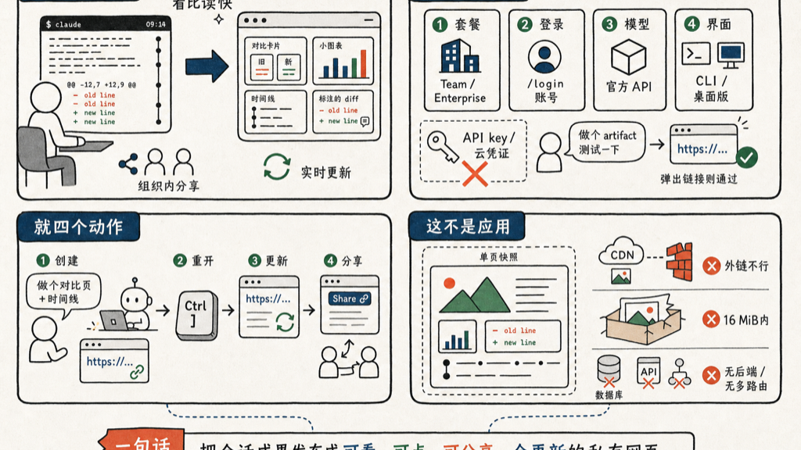

Claude Code 新出的 Artifacts，是把会话里的工作成果，直接发布成一个能在浏览器里打开的实时网页——链接私有，可以分享给团队。

不是插件，不用装。它是 Claude Code 内置的功能，由你的套餐和登录方式「门控」。

我先说它解决什么，再说怎么开、怎么用。

## 为什么需要它

过去 Claude Code 的输出全堆在终端里，是文本。

但有些东西天生不适合一行行读：一份带标注的代码 diff、一张统计图表、几个方案的并排对比、一条随着长任务推进不断填充的调查时间线。这些东西，看比读省事得多。

Artifacts 就是把这类输出，变成一个网页。

它最舒服的地方，是**直接从你当前会话的上下文里生成**——不用搭任何后端、不用配环境，他直接拿你的代码库、拿 MCP 工具连进来的数据，把页面画出来。一句话能让他做的事，画成图省掉一整段描述。

几个我觉得最实用的点：

- **实时更新**：长任务跑着，他边做边往同一个 URL 重新发布，页面原地刷新。打开链接的人不用盯终端。
- **组织内私有**：默认只有你自己能看，可以授权给指定同事或整个组织。但出不了你的组织——外部人看不了。
- **它是成果快照，不是应用**：单个自包含网页，没有后端。存不了表单、运行时调不了 API、没有多路由。要做带后端的内部工具，还得自己部署。



## 第一步：满足条件，把它开起来

这是最容易卡住的地方，按顺序自查。

| 条件 | 要求 |
|------|------|
| 套餐 | Team 或 Enterprise。Team 默认开；Enterprise 要管理员在后台开 |
| 登录 | 必须 `/login` 登录 claude.ai 账号，**不能用 API key** |
| 模型 | 走 Anthropic 官方 API，Bedrock / Vertex / Foundry 都不支持 |
| 界面 | Claude Code CLI，或桌面 app 1.13576.0 以上 |

登录这一步最坑。用 API key、LLM 网关 token、或者云厂商凭证跑的会话，一律发布不了，必须是登录 claude.ai 账号。在终端里：

```bash
claude
/login
```

Enterprise 的话，管理员要去 claude.ai 后台 `Settings → Claude Code → Capabilities`，打开 Artifacts 开关。

**怎么验证开没开**：对他说一句「做个 artifact 测试一下」。如果他发布并给你一个 URL，就通了；如果他只在本地写了个 `.html` 文件、没给链接，或者说发布不了，那就是上面某个条件没满足，回头查。

## 第二步：用起来，就四个动作

| 动作 | 怎么做 |
|------|--------|
| 创建 | 大白话描述你想看的东西，比如「做个 artifact，把这个 PR 的 diff 逐行标注讲一遍」。他写文件 → 首次发布问你确认 → 选 Yes → 打印 URL 并自动开浏览器 |
| 重开 | 终端里按 `Ctrl+]`，重新打开最近一个 artifact |
| 更新 | 让他改：「在汇总图下面加个分地区拆解，重新发布」。改完发布到同一个 URL，每次发布存成一个版本 |
| 分享 | 页面头部的 Share 控件，授权给指定人或整个组织 |

创建不用记什么命令，描述清楚要看什么就行。判断标准很简单：**这个东西是看着方便，还是读文字方便？** 看着方便的，就让他做成 artifact。带标注的 diff、图表、几个方案并排，都是好例子。

还有个巧用：让页面带个「Copy as prompt」按钮。你在网页上拖拽、调参、排序，调完点一下复制，把结果粘回终端——交互的结果就流回会话里了。等于拿一个临时网页当了决策编辑器。

跨会话改旧的 artifact，记得**把那条 URL 给他**，否则新会话只会新建一个。

想让生成的页面配色符合你自己产品的样子，把设计 token（颜色、字体、间距）写进 `CLAUDE.md`，他生成时会优先用你的设计系统，而不是自己瞎选。

## 几个一定会踩的坑

它是 CSP 严格沙箱里的自包含单页，这带来三个反直觉的限制。

**图会丢、外部资源加载不出来**：CSP 把所有外部请求都拦了——CDN 脚本、外链字体、外链图片、fetch、XHR、WebSocket，全不行。所以他会把 CSS / JS 内联、图片转成 data URI。你自己塞外链资源进去，是不会生效的。

**发布失败说太大**：渲染后的页面必须在 16 MiB 以内，超了通常是内嵌了大图。图表优先用 SVG 或纯 CSS，别用栅格图——既绕开体积问题，也更省 token。

**别拿它当应用**：它是静态快照，没后端。存不了数据、运行时调不了 API、没有多路由。要真做带后端的内部工具，老老实实自己部署。

## 一句话总结

它把「Claude 干完的活」从终端里那一坨文本，变成一个能看、能点、能分享、还会自己更新的网页。

代码评审、调查时间线、方案对比、临时 dashboard——以前你得把这些粘到 Slack 里描述半天，现在甩一条链接就行。

## 参考资料

- [Artifacts in Claude Code（官方博客）](https://claude.com/blog/artifacts-in-claude-code)
- [Share session output as artifacts（官方文档）](https://code.claude.com/docs/en/artifacts)

如有错误，欢迎评论区指正。
