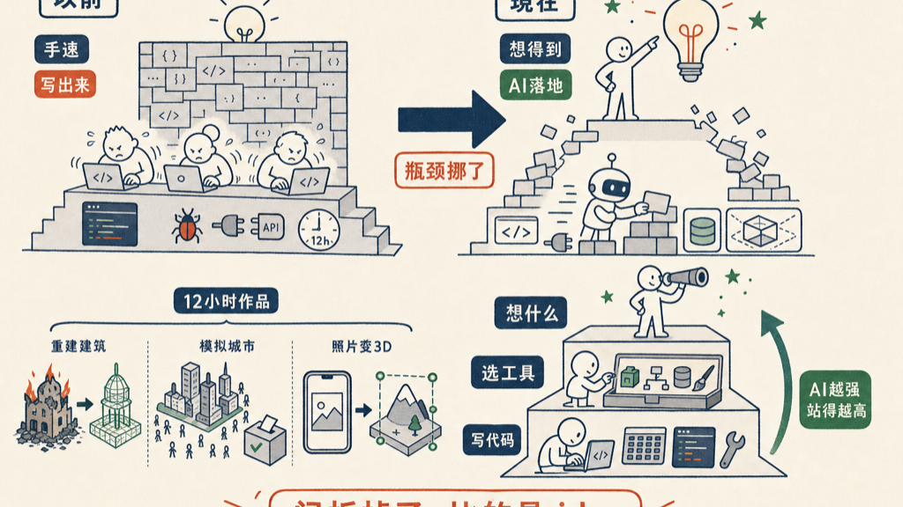

Hackathon 变天了。

以前比的是手速——12 个小时，谁能把脑子里的东西敲成能跑的 demo，谁就赢。代码写得快、bug 少、接口接得上，是硬功夫。

现在不是了。AI 把人们从繁重的手工 coding 里解救出来了。你不用再为一个 API 怎么调、一段 3D 渲染怎么写发愁，那些活交给他。你只要有 idea，剩下的天马行空，他帮你落地。

Claude Opus 4.8 的 Build Day Hackathon 刚办完，看一眼获奖名单，就知道这句话不是空话。

| | |
|---|---|
| 时长 | 12 小时 |
| 时间地点 | 2026 年 6 月 13 日，旧金山 |
| 参赛 | 310 人到场，1500+ 人报名 |

第一名 Tekton，把烧毁的历史建筑在 3D 里重建出来——不是随便搭个壳子，是追溯每一个构件的史料来源，跨越 339 个施工阶段，还专门派了独立的核查 agent 去验证准确性。两个作者是在另一场 Code with Claude 活动排队买咖啡时认识的，动手前先列了一张 50 张工单的路线图。

第二名 Sim Francisco，给旧金山造了个数字孪生：一万个按人口普查数据生成的合成居民，对着这座模拟出来的城市做民意调查，预测真实选举和公投结果，误差只有几个百分点。最狠的是——Claude 自己写了一套进化聚类算法，把居民压成 300 个代表性人格，把推理成本砍掉了 10 到 100 倍。

第三名 Custom Universe，手机拍一张照片，实时变成可编辑的 3D 场景，给需要合成训练数据的机器人实验室用。

这三个东西，放在三年前，哪一个不是一个团队干上几个月的活？现在 12 个小时，几个人就做出来了。

为什么？因为瓶颈挪了位置。

以前的瓶颈是「能不能写出来」。一个想法再好，写不出来就是零。所以 hackathon 的高手，是那些手最快、库最熟、踩过最多坑的人。

现在的瓶颈是「想不想得到」。写出来这件事 AI 包了。失火的教堂值得重建、一座城市可以被模拟出来投票、一张手机照片能变成机器人的训练场——这些 idea 本身，才是稀缺的东西。

第三名那两个作者留了一句话，我觉得是整场 hackathon 最值钱的一句：

> 用 Claude 来帮你选工具，而不只是帮你写代码。

这句话点破了新的游戏规则。代码只是最末端的执行。往上一层，是选什么工具、搭什么架构；再往上一层，是到底要做一件什么事。AI 越强，你能往上站的层级就越高。

手停在键盘上敲字的人，和站在最高层想 idea 的人，差的不是熟练度，是站位。

所以现在的 hackathon，真正在比的是：你脑子里有没有一个别人没想到、而且值得做出来的东西。

AI 已经把那扇「不会写代码」的门拆掉了。门后面是什么，看你的 idea 够不够野。

## 参考资料

- [Meet the winners of our Claude Opus 4.8 Build Day hackathon](https://claude.com/blog/meet-the-winners-of-our-claude-opus-4-8-build-day-hackathon)
