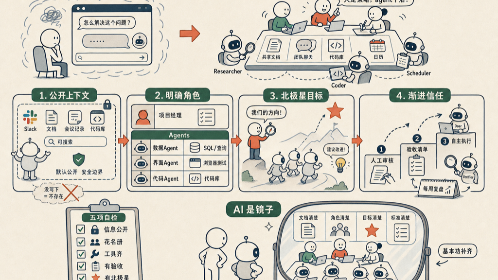

以前用 AI，是单人游戏。一个人对着一个聊天窗口，一问一答，做完关掉。

现在变成了多人游戏。

一个团队的人一起指挥同一批 AI agent，人定策略，agent 干活。这不是把聊天窗口多开几个，是协作方式彻底换了——agent 得有持久的记忆、自己的凭据、对团队信息的广泛访问权。

Anthropic 最近写了一篇 《Building Effective Human-Agent Teams》，把怎么带好这样一个人机混编团队，总结成四条。我读下来的感觉是：没一条是新的。它们都是带真人团队带了几十年的老规矩。只是 AI 进来之后，这些规矩第一次变成了硬约束——人能靠默契补上的漏洞，agent 补不上。

## 第一条：让 agent 在公开环境里工作，给他足够的上下文

agent 对世界的全部理解，来自他能读到的文字——Slack、代码、文档、会议记录。**没写下来、搜不到的东西，对他来说就等于不存在。**

人不一样。人靠走廊里一句话、靠会后私下补一句、靠「你懂的」就能对齐。agent 没有这些。你脑子里那条没说出口的前提，他永远不知道。

所以 Anthropic 的做法是：不去一条一条决定哪条信息分享给 agent，而是按整个 Slack workspace、整个会议记录库、整个文档库划定安全边界。边界之内，默认全公开、可检索。

这省掉了海量的逐条授权，也让 agent 能主动捞出那些人本来会漏掉的相关信息。

## 第二条：每个人、每个 agent 都有明确的角色和趁手的工具

团队里每个成员——不管是人还是 agent——都该有一份说得清的职责清单，知道自己拥有什么、对什么负责。

agent 也一样。这个管数据分析，给他 BigQuery 的权限；那个管界面走查，给他 Playwright。角色定了，工具配齐，他才干得动活。

最怕的是另一种局面：没人给 agent 定角色，于是每个人在旁边偷偷养自己的一队 AI，各干各的。结果是重复劳动，是团队的共识被撕成一片一片——每个 AI 只知道主人那点上下文，拼不起全局。

角色清单这件事，本质是把「谁负责什么」从默契变成白纸黑字。

## 第三条：立一个北极星，agent 才会主动

人负责立北极星。这件事 agent 干不了，也不该干——目标要扎在业务的使命和方向上，这是人的判断。

但北极星一旦写下来、共享出去，事情就变了。你可以指定某些 agent，让他们对着这个目标主动提新的工作流，而不是干等着派活。

Anthropic 自己的例子：内部工具团队把北极星定成「让产品的新手引导更好用」。定完之后，一个 agent 主动建议改某段文案——数据上真的变好了。

没有北极星，agent 最多是个听话的执行器。有了北极星，他才知道往哪个方向使劲，才会主动。

## 第四条：信任是慢慢长出来的

agent 拿到多大的自主权，取决于他证明了自己多可靠，然后再有意识地一点点放宽。

一开始，人手工审他的每一份产出，给关键任务设好验收清单。等他稳定了，再扩大他能独立做的范围。

这里有个很实用的结构，叫 **Doer-Verifier**：一个 agent 干活，另一个 agent 专门查他干得对不对。让 AI 互相验，比人盯着每一步省力得多，也更稳。

Anthropic 还会每周做复盘，让 agent 自己把「这周学到了什么、踩了哪些坑」写下来。错误被记下来，下次才不再犯——这套对人管用，对 agent 一样管用。

## 五个问题，自检你的团队准备好了没

Anthropic 在文末给了五个问题。我把它当成一张体检表——任何一条答不上来，就说明那个地方还没准备好让 agent 进来：

1. agent 和人需要的信息和访问权，是不是都公开、都可检索？
2. 你能不能写下团队的花名册（人 + agent），说清每个成员拥有什么？
3. 团队里每个人、每个 agent，是不是都拿到了干活需要的工具？
4. 关键产出，你有没有给人和 agent 都能用的验收标准或测试？
5. 你的团队有没有一个谁都能引用的北极星？

## 这意味着什么

这四条里，没有一条是关于 AI 的黑科技。

公开协作、明确分工、共同的目标、靠复盘建立信任——这些是健康团队几十年来一直在做的事。AI 没有改写这些规矩，只是把它们逼到了台面上。

人之间，很多东西可以靠默契兜底：没写下来的前提、没定清的职责、没说出口的目标。团队照样能转，只是转得糙一点。

agent 兜不了这个底。他只认写下来的东西。所以你想让 agent 真正融进团队，反而被逼着先把这些一直含糊着的基本功补齐——把上下文写下来，把角色定清楚，把目标摆明白，把验收标准建起来。

换个角度看，这其实是好事。一个能让 agent 干得好的团队，本来就是一个对人也更清楚、更高效的团队。AI 不过是那面照出你团队基本功的镜子。

## 参考资料

- [Building Effective Human-Agent Teams](https://claude.com/blog/building-effective-human-agent-teams)

如有错误，欢迎评论区指正。
