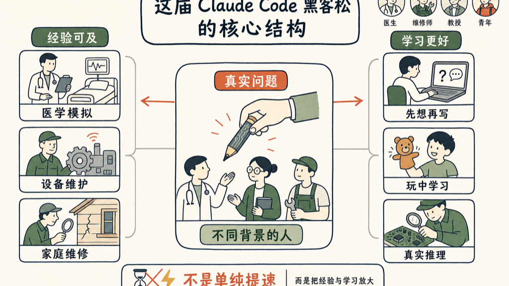

这届 Opus 4.7 Claude Code 黑客松，冠军是个医生。

不是退休医生，不是兼职写代码的医生——是伊斯坦布尔的执业内科医生 Bedirhan Keskin，在四段 Claude Code 对话里，用语音优先的方式，搭出了一个给住院医生培训用的医学模拟器。三所医学院和一家药企已经开始试点。

亚军是法国的电子维修师，第三名是智利的计算机科学教授。

特别奖里有一个20岁的智利年轻人，来自一个叫 Chiloé 的小岛，他说自己之前完全没有编程经验。他做了一个帮当地工匠诊断房屋问题的工具，说这个工具「他自己爸爸能用」。

这是六月中旬 Anthropic 办的 Claude Code 黑客松，以 Opus 4.7 命名，在旧金山 Claude Build Day 之前举行。

## 六个获奖项目，快速过一遍

**第一名：Medkit**

医学模拟器。住院医生可以在里面模拟接诊真实病人——问病史、开化验单、看影像、下诊断、开处方。用的是 Claude Managed Agents，有一套基于临床指南的自动评分系统。

**第二名：Wrench Board**

电子维修 AI 诊断工具。输入原理图、电路板视图和症状，工具生成电气图，推理出问题位置，精确到具体元件。用了多智能体并行，发挥了 Opus 4.7 读懂图纸的能力。

**第三名：Maieutic**

给学生用的 IDE，名字取自苏格拉底的产婆术。核心思路：逼学生先用自然语言写清楚自己想做什么，才能开始写代码；代码补全被替换成反问——不给答案，给问题。教授仪表盘能看到全班的认知状态。现在有休斯顿大学的研究者想合写论文。

**最有创意奖：Virtual Puppet Theater**

浏览器里的实时木偶剧。摄像头捕捉手势（MediaPipe），Three.js 60fps 渲染，AI 驱动对话。作者说他唯一需要的用户测试，是看到他儿子跟木偶交谈、咯咯笑。

**"Keep Thinking" 奖：MaestrIA**

面向智利家庭维修的诊断工具，同时帮工匠展示专业能力。有意思的细节：他们把17条诊断规则、7种本地木材、16个行业术语、19个参考价格、9种常见错误打包成一个 JSON 文件，评估准确率从74%提到81%。

**最佳 Claude Managed Agents 使用奖：ARIA**

工厂设备维护系统。把老技工的经验转化成可部署的 AI，实时监控设备、预测故障。两个人花了整整第二天做规划，之后才开始写代码。他们说 Claude Code 写了约80%的代码，他们负责领域逻辑和设计决策。

## 几句值得记下来的话

冠军 Bedirhan 说：「Claude 不只是代码生成器，他是思维伙伴，帮我看到我自己会错过的选项。」

亚军 Alexis 说：「Claude Code 放大了有想法、有耐心执行的人，不管他们的起点在哪。」

Maieutic 的作者 Paula 说：「那个让你真正成为程序员的元认知循环——思考你自己的思考——从来没有真正闭合过。」她的工具是在强制把这个循环装回去。

## 我注意到的一件事

这六个项目，可以分成两类。

三个在做「让专家的经验变得可及」：Medkit 让临床教学规模化，ARIA 让老技工的判断力变成可部署的系统，MaestrIA 让工匠的专业知识能被更多人用到。

另外三个在做「让学习过程本身变好」：Maieutic 防止学生绕过认知，Virtual Puppet Theater 让孩子在玩里面学，Wrench Board 让维修工人能在真实问题上推理。

没有一个是为了「让工作更快完成」。

这届的主题藏在建造者的背景里——医生、教授、工匠顾问、20岁的岛上年轻人。Claude Code 放进了他们手里，他们做的第一件事，是去解决自己领域里真实存在的问题。

## 参考资料

- [Meet the winners of Built with Opus 4.7 Claude Code Hackathon](https://claude.com/blog/meet-the-winners-of-built-with-opus-4-7-claude-code-hackathon)

如有错误，欢迎评论区指正。
