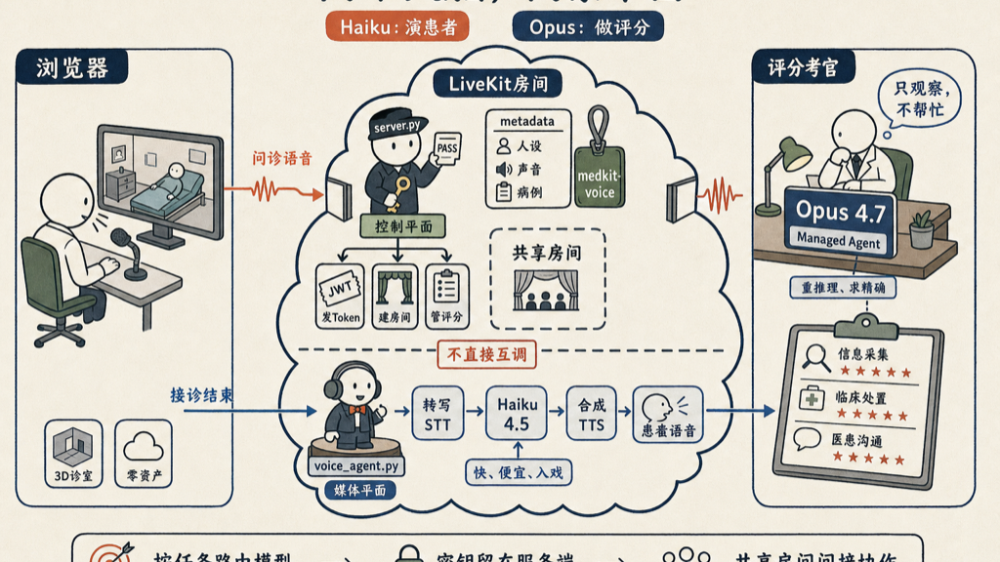

我研究了这个项目的源码，基本知道了它的流程。学习一个技术的最好方法，就是学习和模仿别人的思路和方法。

Opus 4.7 Claude Code Hackathon 的获奖项目 medkit，是个浏览器端的急诊 + 门诊临床培训模拟器。你扮演医生：新患者到分诊台，你问诊、开检查、下医嘱、做处置。**特别的地方在于：你是真的开口说话**——一条实时语音对话管道贯穿整个接诊过程——而另一个 AI 在角落里默默观察，接诊结束时像 OSCE 考官一样给你打分。

这逼着两个差异极大的 AI 工作负载并存：

1. **快、便宜、要入戏的患者声音** — 实时响应，不能等几秒。
2. **严谨、重推理的评分机器** — 临床决策的对错不能模糊。

整个架构的设计思路就是把这两件事拆开。

## 全局：两个大脑，两个平面

两个原则贯穿整个设计。

**第一：按任务路由模型。**

| 任务 | 模型 | 理由 |
|------|------|------|
| 患者语音/角色扮演 | **Claude Haiku 4.5** | 快、便宜，入戏够用 |
| `medkit-attending` 临床评分 | **Claude Opus 4.7**（Managed Agent）| 临床推理要精确 |
| 分诊 ESI 分级 | Claude Opus 4.7 | 一次性调用，准确性优先 |

**第二：后端分两个进程，控制平面和媒体平面各管各。**

| 进程 | 职责 | 比喻 |
|------|------|------|
| `backend/server.py`（FastAPI）| 控制平面——签发 token、建房间、托管评分 Agent | 搭台子的 |
| `backend/voice_agent.py`（LiveKit worker）| 媒体平面——加入房间，化身患者声音 | 上台的演员 |

关键：**这两个进程从不互相调用**。它们通过第三方服务 LiveKit Cloud 以「共享房间 + 共享名字」的方式间接相遇。



## server.py — 控制平面

`server.py` 是跑在 `127.0.0.1:8787` 的 FastAPI 服务，它存在的唯一理由是：**让付费 API 密钥（Anthropic、LiveKit、Deepgram、Cartesia）永远不触达浏览器**。三件事：

**1. 托管 Claude Managed Agents 代理（`/agent/*`）**——持有 `medkit-attending` 评分 Agent，这是核心职责。

**2. 签发 LiveKit 语音 token（`/voice/token`）**——浏览器 POST 过来时，服务器：
- 构造房间名 `gr-<case>-<nonce>`
- 把患者角色定义（system prompt、voice ID、病例信息）塞进房间的 **metadata**
- 通过 LiveKit API 预建房间，附带 `RoomAgentDispatch(agent_name="medkit-voice")`
- 返回浏览器入场用的短期 JWT

它不跑语音对话，只建好舞台和门票。

**3. 健康检查（`/health`）**。

横切关注点：从 `backend/.env.local` 加载密钥（不用 `python-dotenv`），对 `/agent/*` 和 `/voice/*` 验共享密钥头挡 curl 滥用，`slowapi` 限速保护 API 额度。

## 评分 Agent：medkit-attending

临床考官是一个名叫 `medkit-attending` 的 **Claude Managed Agent**，跑在 Opus 4.7 上。Managed Agents 是 Anthropic 的托管产品：Anthropic 运行 agent loop，你只需创建一次持久化的 **agent** 配置，之后每次接诊开一个 **session** 就行。

### 只观察，不帮忙

System prompt 写得很直白：*"你是带教医师……你的职责是观察他们的决策并评分。你不是助手、不是向导、不是教练。沉默是可接受的，往往也是正确的。"*

两种模式：

**实时观察**（接诊中）：监听事件流，通过自定义工具渲染界面叠加层——`render_triage_badge`、`render_bed_map`、`render_vitals_chart`、`render_patient_timeline`、`flag_critical_finding`（触发确认弹窗，仅限心脏骤停/卒中时间窗/气道/过敏性休克，每次接诊最多触发一次）、`lookup_ehr_history`（通过凭证保险库路由，EHR token 不进 context）。默认保持安静，不问、不旁白、不剧透。

**总结模式**（接诊结束）：收到 `[debrief request]` 后，按 PLAB2/OSCE 标准，对照病例的 `CaseRubric`，从**信息采集、临床处置、医患沟通**三个维度打分，附带可选的安全网评估。输出唯一一个 `render_case_evaluation`，含每个评分项的结论（达到 / 部分 / 未达到）、证据和教学反馈。引用纪律严格：每个 `guideline_ref` 必须能在提供的 registry 里找到，引用，不发明。

### 生命周期：创建一次，每次接诊调用

```
useAttendingDebrief.ts
  → bootstrap()                  POST /agent/bootstrap       （确保 agent 存在）
  → createSession("debrief-…")   POST /agent/sessions        （每次接诊开一个 session）
  → sendUserMessage([debrief])   POST /agent/sessions/:id/events
  → stream                       GET  /agent/sessions/:id/stream  （SSE）
```

驱动 session 的关键是 **events 子资源**，不是 session 对象本身：

| 操作 | 端点 | 用途 |
|------|------|------|
| 创建 | `POST /agent/sessions` | 开对话容器 |
| **写（驱动）** | `POST /agent/sessions/:id/events` | 推用户事件，让 agent 行动 |
| 读历史 | `GET /agent/sessions/:id/events` | 重连时补档 |
| 实时流 | `GET /agent/sessions/:id/stream` | 浏览器订阅的 SSE |

`GET /agent/sessions/:id/stream` 是个健壮的 SSE 代理：打开上游 Anthropic 事件流，逐个以 `event:`/`data:` 格式重发给浏览器的 `EventSource`；每 tick 检查 `request.is_disconnected()` 在浏览器离开时释放上游连接；agent 沉默期间发 `: keepalive` 注释防止代理断链；任何上游异常都转成 `proxy_error` 事件通知客户端管道断了。浏览器在发 debrief 事件前先打开流（stream-first 顺序），确保不丢消息。

## voice_agent.py — 媒体平面

独立的长驻进程，基于 **LiveKit Agents** 框架：

```bash
backend/.venv-voice/bin/python backend/voice_agent.py dev
```

每进入一个房间，跑这条语音管道：

```
医生麦克风 → Deepgram Nova-3 (STT) → Claude Haiku 4.5 (对话) → Cartesia Sonic-2 (TTS) → 医生耳机
```

加 Silero VAD 做轮次切换。

几个设计点值得注意：

- **它本身不知道谁是患者。** 进房间后读 `ctx.room.metadata` 拿 `systemPrompt`、`voiceId`、开场白——全是 `server.py` 写进去的。患者内容归 TypeScript 侧管，worker 是个通用容器。
- **声音确定性：** `pick_voice` 用 case ID 的 FNV-1a 哈希选 Cartesia 声音，和 TS 侧的哈希算法完全镜像——同一个患者永远用同一个声音。
- **语音书端：** 患者一进场就说主诉（`generate_reply`）；接诊结束时浏览器触发 `farewell` RPC，患者通过直接 TTS（`session.say`，不走 LLM）说一句告别——房间拆除时音频不会突然切断。

它是个 **worker**，不是单次函数：启动后注册到 LiveKit Cloud 成为 `medkit-voice`，等待被派到房间，一生处理多次接诊。

## LiveKit Cloud — 中间层

LiveKit 是语音的全部传输基础设施，在三个层次出现：

- `server.py` 用 `livekit-api` **配置**——建房间、签 JWT
- `voice_agent.py` 用 `livekit-agents` **注册并加入**——跑 STT→LLM→TTS 插件
- 浏览器用 `livekit-client` **连接**——发布麦克风、订阅患者音频（自动挂到页面 `<audio>` 元素）、收实时转写（`RoomEvent.TranscriptionReceived`）、把远端音频接入 Web Audio `AnalyserNode` 做口型同步、`performRpc` 触发告别

两个后端进程怎么在从不互相调用的情况下配合？三个契约：

1. **房间 + metadata。** `server.py` 把角色定义写进房间 metadata；`voice_agent.py` 进房间时读出来。
2. **派发名字。** `server.py` 建房间带 `RoomAgentDispatch(agent_name="medkit-voice")`；worker 注册 `WorkerOptions(agent_name="medkit-voice")`。字符串 `"medkit-voice"` 两侧硬编码，必须完全一致——进程跑在不同 venv（甚至不同地域），没有共享配置模块。名字一漂移，worker 永远不会被派过来，语音悄无声息地失效。
3. **共享密钥**，来自 `backend/.env.local`。

```
浏览器 ──POST /voice/token──► server.py
                                   │ 建房间 "gr-…" + metadata{systemPrompt, voiceId}
                                   │ + RoomAgentDispatch("medkit-voice")
                                   ▼
                             LiveKit Cloud  ◄──注册为 "medkit-voice"── voice_agent.py
                                   │ 把 worker 派进房间
浏览器 ──JWT，加入房间────────────┤
                                   ▼
                          voice_agent.py 读 ctx.room.metadata → 化身患者
```

## 病人的话从哪里来

这是让人意外的部分。模拟器里**医生（玩家）提问，患者回答**，这两条流的来源完全不同。

**医生的问题 → 麦克风。** 没有 AI 生成你的问题。你说的话走 `mic → Deepgram STT → 文字`，转写结果作为 **user turn** 喂给 Haiku。

**患者的回答 → Haiku，但由病例数据编剧。** Haiku 生成患者回复，但患者是谁、有什么症状，来自 `PatientCase` 数据对象，注入进 system prompt：

```
src/data/patients.ts    ← PatientCase: 姓名、年龄、性别、主诉、症状、隐藏信息
        ↓
patientPersona.ts  buildPersona(case)   ← 把病例转成 system prompt
        ↓
conversationStore.ts   systemPrompt = buildPersona(patientCase, setting)
        ↓
conversation.ts   POST /voice/token  { systemPrompt, initialLine, ... }
        ↓
server.py /voice/token   → 把 systemPrompt 写进 LiveKit 房间 metadata
        ↓
voice_agent.py   system_prompt = meta.get("systemPrompt") → Agent(instructions=system_prompt)
        ↓
Haiku 4.5   在这个人设里生成每一句角色台词
```

角色提示词很明确：*"你是一个叫 `${c.name}` 的人类患者，`${c.age}` 岁……任何情况下都不提及 AI、语言模型、提示词、角色扮演……"* 甚至禁止 `*winces*` 这类旁白——情绪要通过语言和停顿表达，因为文字直接进 TTS。

`buildPersona` 按年龄分叉：**成人**自己开口；**儿科**病例换成*家长*人设，由家长代为表述。

唯一预先编好的台词是**开场白**——`buildInitialLine` 返回主诉原文，worker 一进场就让患者说出来。之后全靠 Haiku 在人设内回答你的问题。

### 为什么用 Haiku 4.5，temperature 0.8

- **Haiku 4.5**：语音循环是硬实时，最快最便宜，「保持人设、一两句话回复」不需要 Opus 级别的推理。临床推理刻意路由到别处——Opus 评分 Agent。
- **temperature 0.8**（高）：这是角色扮演，不是信息提取——真实患者不会每次一模一样地回答，高随机性给出自然变化。

一个值得记住的细节：**`temperature` 只对 Haiku/Sonnet 级模型有效**。当前 Opus 4.7/4.8 和 Fable 5 已经移除了 `temperature`/`top_p`/`top_k` 采样参数，传了会报 400——这些模型通过提示词和 `effort` 参数控制行为。`temperature=0.8` 能用，正是因为模型是 Haiku 4.5。

## 可游走的 3D 诊室——零资产文件

你走进去的那个诊室是纯前端 Three.js，后端完全不参与。**整个项目没有任何资产文件**——没有 `.glb`/`.gltf`/`.fbx` 模型，没有贴图，没有素材包。唯一的非代码资产是一个 `.mp3`。

渲染层：
- **Three.js** — WebGL 引擎
- **React Three Fiber**（`@react-three/fiber`）— 用 JSX 声明式写 Three.js；`<Canvas>` 启动渲染器
- **drei**（`@react-three/drei`）— 工具集：`PointerLockControls`、`Html`、`Text`、`RoundedBox`

房间（墙、地板、护墙板、家具）是几百个手动摆放的 `<mesh>` 盒子加 `meshStandardMaterial`。角色也是同样方式拼装——躯干、腿、头、白大褂、眼镜各是一个 `RoundedBox` 或 primitive，每个角色有自己的色板（`col.skin`、`col.shirt`、`col.hair`）。没有骨骼绑定；空闲动作和姿势靠 `useFrame` 循环旋转肢体节点组。

第一人称控制：`PointerLockControls` 捕获鼠标做 FPS 视角；WASD/方向键用 ref 跟踪，`useFrame` 循环沿相机前/右向量移动 `camera.position`；没有物理引擎，纯向量数学。

世界内 UI 的两种做法：

1. **`THREE.CanvasTexture`** — 桌上显示器和证书用 2D Canvas API（`fillText`、`drawImage`）画在离屏 `<canvas>` 上，再贴到场景里的平面 mesh 上。那个「患者病历屏幕」字面意义上是一张 2D 画贴在世界里的显示器上。
2. **drei `<Html>`** — 真正的 React/DOM 元素锚定到 3D 坐标后 CSS 投影到屏幕（悬浮语音面板），保持可点击性。

零资产是有意为之——仓库体积小，没有预加载。

## 模型路由原则

整个架构的核心判断只有一句话：

> **Haiku = 演患者**（快、便宜、实时入戏）。**Opus = 任何需要临床推理或精确性的事**（评分、分诊分级）。

把 Opus 放进语音循环会加几秒的空白和成本；把 Haiku 放到评分会牺牲整个练习所依赖的精度。这个干净的分拆——加上后端的控制平面/媒体平面分拆——让一个实时语音游戏和一个严格的 AI 考官共存在同一个应用里而互不干扰。

## 小结

- **分离平面。** 控制平面（FastAPI：配置、token、评分 Agent）和媒体平面（LiveKit worker：患者声音）只通过共享房间和共享派发名字相遇——独立到可以分别重启。
- **按任务路由模型，而不是反过来。** 实时角色扮演 → Haiku；重推理评分 → Opus Managed Agent。
- **密钥留在服务端。** 浏览器永远看不到 Anthropic 或 LiveKit 密钥，包括 EHR 查询也通过凭证保险库路由。
- **Managed Agents 是「创建一次，每次接诊开 session」。** Bootstrap agent 一次，持久化 ID，每次接诊通过 events 驱动。
- **整个 3D 世界可以纯用代码搭。** 程序化几何 + CanvasTexture + drei `<Html>`，零二进制资产交付一个可游走的诊室。

---

*注：medkit 的病例是合理但合成的，项目不声称临床准确性。*
