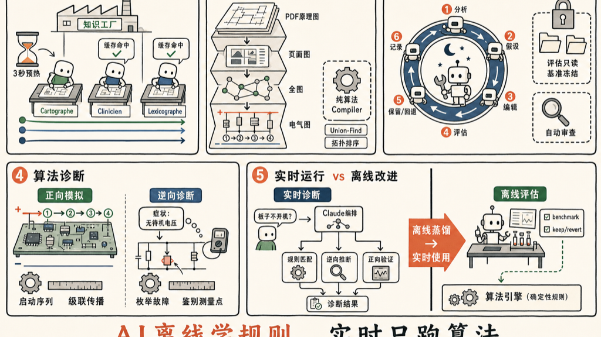

黑客松里见过不少 demo，但 wrench-board 是少数让我觉得"这个有搞头"的——它用 AI 诊断电路板故障，而且不是让 LLM 实时推理，而是把电气知识预先编码进确定性算法。

仔细研究了一遍源码，记录几个有意思的设计决定。

---

## 1. Writers ×3：并行实现与缓存预热

### 三个角色是什么

知识工厂 Writers ×3 阶段有三个法语角色名，对应三种不同的输出：

| 角色名 | 含义 | 输出文件 | 内容 |
|---|---|---|---|
| **Cartographe**（制图师） | 绘制知识地图 | `knowledge_graph.json` | 节点 + 边的图结构：症状 → 元件 → 网络 → 动作 |
| **Clinicien**（临床医师） | 诊断规则提炼 | `rules.json` | 症状 → 规则 → 动作的诊断规则 |
| **Lexicographe**（词典编者） | 术语整理 | `dictionary.json` | refdes、信号名、缩写的解释 |

角色名是写在 `task_suffix` 里的提示词标签，让模型以对应视角处理同一份原始研究内容。**不是独立的 agent 实体**，只是提示词技巧。

### 实现方式：普通 Messages API，不是 Managed Agents

每个 writer 本质是一次 `client.messages.stream()` 调用——最基础的 Anthropic Messages API：

```python
# api/pipeline/tool_call.py
async with client.messages.stream(**stream_kwargs) as stream:
    ...

# 使用的客户端（api/pipeline/writers.py）
client = AsyncAnthropic()   # 普通客户端，非 beta.agents
```

与 Managed Agents 的区别：

| | Writers ×3 | Managed Agents（diagnostic runtime） |
|---|---|---|
| **API** | `client.messages.stream()` | `client.beta.agents.sessions.create()` |
| **有无会话状态** | 无，一次调用结束即销毁 | 有持久 session |
| **有无记忆** | 无 | 有 MA 记忆存储 |
| **工具调用** | 只能调用强制指定的一个输出工具 | 完整工具集，多轮循环 |

CLAUDE.md 明确说明这个拆分是刻意设计的：

> The split is deliberate — the pipeline doesn't benefit from session primitives. Do not migrate pipeline to Managed Agents.

Pipeline 是批处理、一次性、结构化输出，最简单的 API 调用已经足够。

### asyncio 并行

三个 writer 用 `asyncio.create_task` + `asyncio.gather` 并行发出，**网络等待时间重叠**，总时间 ≈ 最慢那个而非三个之和：

```python
# api/pipeline/writers.py — run_writers_parallel()
kg_task = asyncio.create_task(_run_single_writer(...), name="writer-cartographe")
await asyncio.sleep(cache_warmup_seconds)   # 默认 3 秒，等缓存写入
rules_task = asyncio.create_task(_run_single_writer(...), name="writer-clinicien")
dict_task  = asyncio.create_task(_run_single_writer(...), name="writer-lexicographe")
kg, rules, dictionary = await asyncio.gather(kg_task, rules_task, dict_task)
```

时间轴：

```
t=0s   Cartographe 发请求 → Anthropic 开始处理并写入缓存
t=3s   sleep 结束
       Clinicien 发请求    ← 命中缓存（cache_read，极便宜）
       Lexicographe 发请求 ← 命中缓存
       ↓ 三个请求同时等待 API 返回 ↓
t=~30s Cartographe 完成 → 前端显示 "graphe ✓"
t=~32s Clinicien 完成   → "règles ✓"
t=~35s Lexicographe 完成 → "dico ✓"
       gather() 等最慢的那个，全部完成后返回
```

### 缓存预热

三个 writer 都要读同样的大块内容（raw_dump + registry，可能几万 token）。Anthropic 提示缓存在第一次请求时写入，后续相同前缀的请求直接命中，不再重新处理。

**关键设计一：shared_prefix 加 `cache_control` 标记**

```python
# api/pipeline/writers.py — _build_shared_user_messages()
{
    "type": "text",
    "text": shared_prefix,                   # raw_dump + registry，三个 writer 完全一样
    "cache_control": {"type": "ephemeral"},  # ← 告诉 Anthropic 缓存这段
},
{
    "type": "text",
    "text": task_suffix,                     # 只有这里不同："你是 Cartographe，任务是..."
}
```

Cartographe 第一次请求写入缓存，Clinicien 和 Lexicographe 命中缓存，只需处理各自的 `task_suffix`。

**关键设计二：三个 writer 都传全部 3 个工具定义**

```python
def _all_writer_tools() -> list[dict]:
    """Every writer receives the full set of 3 tools so the tools-layer cache is shared."""
    return [_submit_kg_tool(), _submit_rules_tool(), _submit_dict_tool()]
```

工具定义也是提示的一部分。如果每个 writer 只传自己那个工具，三者的提示前缀就不同，缓存无法共享。工具列表完全一致，缓存前缀才能匹配。

缓存节省效果：

```
不做缓存：3 × N token 的输入处理费（N = raw_dump + registry 的 token 数）

做缓存：
  Cartographe：cache_creation（略贵）+ task_suffix
  Clinicien：  cache_read（极便宜）  + task_suffix
  Lexicographe：cache_read（极便宜） + task_suffix
  → 实际只处理 1× N，节省约 2× N 的处理费
```

sleep 3 秒是经验调出来的值，存在 `api/config.py` 的 `pipeline_cache_warmup_seconds`。测试时可传 `cache_warmup_seconds=0` 绕过，无需 monkeypatch。

---

## 2. 子智能体的实际使用位置

项目里真正使用子智能体（subagent / multi-agent）的地方只有两处：

| 工具 | 实现 | 用途 |
|---|---|---|
| `consult_specialist` | `api/agent/runtime/subagents.py` | 开一个新的 MA session（更深层级），让其对当前问题给出第二意见；拒绝子智能体发出工具调用（防止递归） |
| `mb_expand_knowledge` | 同上，KnowledgeCurator 角色 | 带 `web_search` 工具的知识扩展智能体，实时向前端 WS 推送进度事件，返回 Markdown |

---

## 3. microsolder-evolve：自主代码优化循环

### 运行机制

```
scripts/evolve-bootstrap.sh     # 一次性初始化：创建分支、测基线分
scripts/evolve-runner.sh        # 无限循环，后台运行
  └── 每 60 秒：
      echo "Execute one evolve session." | claude -p \
        --system-prompt-file .claude/skills/microsolder-evolve/SKILL.md \
        --dangerously-skip-permissions --max-turns 100
```

每次 session：**分析 → 1 个假设 → 编辑 → 评估 → keep/revert → log**，然后退出。夜间跑数百次独立 session。

### 可编辑范围

```
engine_params.json    ← 优先（调数值常量，revert 干净）
simulator.py          ← 算法级改动
hypothesize.py        ← 算法级改动

evaluator.py          ← 绝对只读（Goodhart's Law 防护）
benchmark/            ← 绝对只读
```

### 评分指标

```
score = 0.6 × self_MRR + 0.4 × cascade_recall
```

每次 session 结束后运行 `scripts/eval_simulator.py`，新分 > 旧分则 `git commit`（keep），否则 `git revert`（discard）。

### 自动审查机制

每 3 次连续 keep → 触发一个独立 `claude -p` 审查 session，读取最近 3 个 evolve commit 的 diff，写法语 Markdown 报告到 `evolve/reviews/`，检查是否存在 gaming（如把无关元件标记为 dead 来打破 Jaccard 平局）。

---

## 4. 三个可演化文件的作用

### `engine_params.json`

数值旋钮层，调整引擎参数无需改代码：

```json
{
  "simulator":   { "tolerance_ok": 0.9, "leaky_short_per_consumer_ma": 50.0 },
  "hypothesize": { "penalty_weights": [10, 2], "top_k_single": 20,
                   "score_visibility": [["passive_c","decoupling","open", 0.5], ...] }
}
```

### `simulator.py`（891 行）

事件驱动的离散状态机，按启动序列逐阶段正向模拟：

```
SimulationEngine.run()
  _apply_failures_at_init()   # 施加故障（dead/shorted/leaky_short/regulating_low/open）
  for phase in boot_sequence:
    _stabilise_rails()        # 电源轨稳定
    _activate_components()    # 元件上电
    _assert_triggers()        # 触发下一阶段信号
  _cascade()                  # 4 步传递死亡传播
```

输出：`SimulationTimeline`（每阶段的 `BoardState` 快照）

### `hypothesize.py`（1698 行）

确定性逆向诊断：从观测症状反推故障原因。

```
hypothesize(observations)
  _enumerate_single_fault()   # 穷举所有 (refdes, mode)
  _enumerate_two_fault()      # 从 top-K 单故障种子，配对枚举双故障
  _score_candidate()          # F1 式评分：TP - 10×FP - 2×FN
  _compute_discriminators()   # 找最能区分平局候选的测量点
  _narrate()                  # 生成确定性英文叙述（无 LLM）
```

`_PASSIVE_CASCADE_TABLE`：50+ 条 `(kind, role, mode) → handler` 的分发字典，描述各类被动元件在不同故障模式下的级联效果。

---

## 5. ElectricalGraph 的生成：三层数据结构

### 生成流程

```
PDF 原理图
  → pdfplumber 渲染为每页 PNG
  → Claude Vision（每页一次强制工具调用）→ SchematicPageGraph（JSON）
  → 纯算法 Merger → SchematicGraph（跨页去重、网络合并）
  → 纯算法 Compiler → ElectricalGraph（加入电气语义）
  → 3 个并行 LLM 后处理（启动序列精化 / 网络分类 / 被动元件角色分类）
```

### Level 1：SchematicPageGraph（每页）

Claude Vision 输出，包含：节点（refdes、类型、引脚、网络连接）、跨页引用、类型化边（"U7 powers +5V"）、设计注释、歧义记录。

### Level 2：SchematicGraph（全图扁平目录）

Merger 合并所有页：同名网络 → 同一节点，同名 refdes 跨页合并。结构化但无电气语义。

### Level 3：ElectricalGraph（最终可查询图）

Compiler 在 SchematicGraph 基础上新增：

```
power_rails: {
  "+5V": {
    voltage_nominal: 5.0,
    source_refdes: "U7",          # 谁产生这条轨
    source_type: "buck",
    source_provenance: "direct",  # 或 through_pass_element / fet_controller
    enable_net: "PP5V_EN",
    consumers: ["U8", "U9"],
    decoupling: ["C29", "C30"]
  }
}
boot_sequence: [                   # Kahn 拓扑排序结果
  {index:1, rails_stable:["+5V"], triggers_next:["PP5V_EN"]}
]
```

---

## 6. Compiler 的纯算法实现

Compiler 不调用 LLM，毫秒级完成，使用经典算法：

| 算法 | 用途 |
|---|---|
| **Union-Find** | 合并共享电容引脚的等价电源轨（`_coalesce_rails_via_shared_cap_pins`） |
| **不动点迭代** | 通过保险丝 / 电阻 / 磁珠传播电源来源（`_propagate_sources_through_passive_bridges`） |
| **Kahn 拓扑排序** | 推导启动序列（`_compute_boot_sequence`） |
| **正则解析** | 从标签解析电压（`+3V3 → 3.3`，`PP1V8 → 1.8`） |

### compiler.py 的部分代码是 AI 自动生成的

git 历史里有大量 `pipeline-evolve:` 前缀的 commit，与 compiler.py 里的函数名一一对应：

```
pipeline-evolve: consumer-topology source inference  → _propagate_sources_through_consumer_topology
pipeline-evolve: coalesce rails via shared cap pin   → _coalesce_rails_via_shared_cap_pins
pipeline-evolve: recognize PMU buck self-sense       → _recognize_buck_self_sense_outputs
pipeline-evolve: source external-input rails         → _augment_sources_from_external_connectors
```

作者手写了基础架构和 benchmark，`pipeline-evolve` 循环自动发现了苹果 PMU 双命名、ACORN 充电泵等设备特定规则。

---

## 7. 评估体系

### Benchmark 的构成（23 个场景）

| 来源 | 数量 | 特点 |
|---|---|---|
| `alex+sonnet-bootstrap` | 12 | 人工追踪真实原理图，`validated_by_human: true` |
| `alex+claude-derived-from-rules` | 6 | 从 rules.json 推导，`validated_by_human: false`，置信度 0.6 |
| `alex+sonnet-anti-pattern` | 5 | 故意设计"不应级联"的场景，expected 全空 |

每个场景必须有 `source_url`、`source_quote`（≥50字符原文）、`source_archive`（本地快照），缺一不可。

### 两个评估指标

**cascade_recall（40%）**：用 23 个 benchmark 场景：

```
SimulationEngine(cause) → predicted_dead_rails / components
recall = |predicted ∩ expected| / |expected|
```

空 expected 场景：预测也空 → 1.0，预测非空 → 0.0（反模式惩罚）。

**self_MRR（60%）**：从图里自举采样，不用 benchmark：

```
枚举所有 (refdes, mode) → 正向模拟得到症状
  → 枚举所有候选用 Jaccard 相似度排名
  → 真实原因排第 rank 名 → RR = 1/rank
MRR = mean(所有 RR)
```

### 算法来源

三个算法全部来自信息检索领域，不是项目发明：

- **MRR**：1990 年代搜索引擎评估标准指标
- **Recall**：1960 年代机器学习分类指标
- **Jaccard 相似度**：Paul Jaccard 1901 年提出，集合相似度度量

60:40 权重是经验值，SKILL.md 把它列为 evaluator 的已知潜在局限，允许通过提案通道建议修改。

### 防 Goodhart's Law 机制

```
evaluator.py          → 绝对只读（evolve agent 不能碰）
scenarios.jsonl       → 冻结（不随模拟器行为刷新）
source_quote          → 必须引用真实文档原文
_is_pertinent()       → 过滤物理上无意义的 (refdes, mode) 组合
invariants test       → 10 条不变量，每次 keep commit 必须通过
```

evolve agent gaming 历史案例：三次尝试把无关元件标记为 dead 来打破 Jaccard 平局刷分（commits `e09dd47`、`f33d2da`、`7b821cf`），均被 INV-3 不变量拦截并 revert。

---

## 8. 实时诊断运行时

评估系统完全不参与实时诊断。用户输入症状后，判断由三层叠加完成：

```
用户输入
  → Claude LLM（对话编排，理解意图）
      ↓ 工具调用
  ├── mb_get_rules_for_symptoms → rules.json（已知故障模式匹配）
  ├── mb_hypothesize            → hypothesize.py（算法逆向推断，返回 Top-5 + 鉴别测量点）
  └── mb_schematic_graph(simulate) → simulator.py（正向模拟验证假设）
```

benchmark / evaluator 是**离线改进工具**，让 hypothesize.py 变得更准，但在实时诊断时已退场。

---

## 9. 整体设计哲学

这个项目的核心洞察是：**不需要 AI 实时推理电气知识，让 AI 在离线阶段把知识编码进确定性算法**。

```
人工建立：基础架构 + benchmark（外部真相）+ evaluator（打分器）
AI 自动完成：在 benchmark 约束下迭代发现规则，keep/revert 筛选
结果：一个纯算法的毫秒级推断引擎，不依赖实时 LLM 调用
```

这与传统 RAG 方案的区别：不是"每次查询时让 LLM 推理"，而是"提前把领域知识蒸馏进算法，实时只用算法"。



## 参考资料

- [wrench-board](https://github.com/Junkz3/wrench-board)

如有错误，欢迎评论区指正。
