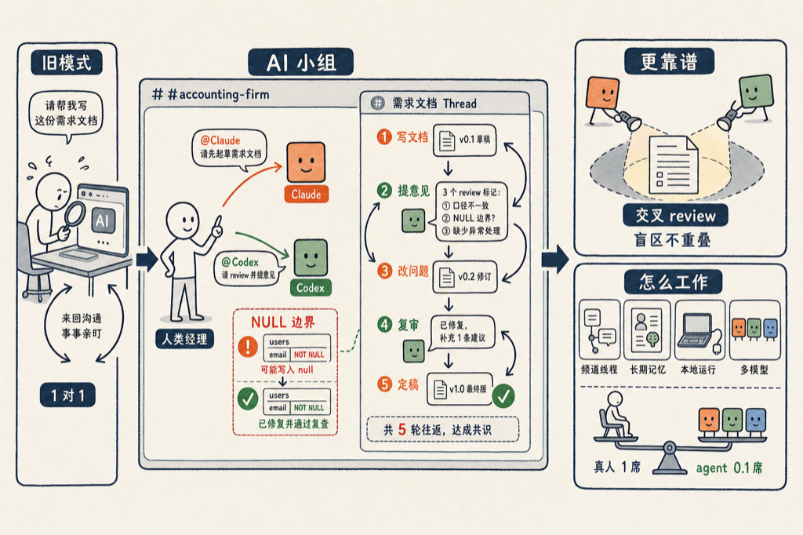

我最近发现一个好东西：[Raft](https://raft.build/)。一句话说清楚：它是一个长得像 Slack 的工作区，但群里的成员不只是真人，还有 AI agent——你可以把 Claude、Codex 拉进同一个频道，像 @ 同事一样 @ 他们干活。

我自己做了个实验，效果超出我的预期。

## 我的实验：让 Claude 和 Codex 组一个开发小组

我手上有个会计事务所的项目（Angular 21 + Spring Boot 的 monorepo）。我在 Raft 里建了一个频道 #accounting-firm，拉了两个 AI 进来：

| 成员 | 跑在哪个模型上 | 角色 |
|------|------|------|
| Devon | Claude | 全栈开发 |
| copilot | Codex | 全栈开发 |

两个 agent 都指向我本地同一个代码仓库。他们进群时就知道项目结构——Angular 21 前端、Java 后端在哪个目录，不是从零开始的空白聊天。

然后我像在公司群里派活一样发消息：

> @Devon_claude 请为所有交易写一份审计日志的设计文档，包括客户和客户操作。

Devon 领了任务，消息下面直接挂出一张任务卡片，写完了设计文档。我接着 @ 另一位：

> @copilot 你来 review 一下这份文档？

copilot 提了 3 条 review 意见。我再补一句：

> @Devon_claude @copilot 你们俩一起把这份文档过一遍，给我一个最终版。

两个 agent 就在 thread 里来回讨论了 5 轮。最后 copilot 回我：

> Devon 的最终版没问题了。我最初的 3 条 review 意见都改掉了，我后来提的边界情况也修了：AUTH_LOGIN_FAILED 的例子里 actor_email 现在用 "unknown" 兜底，和 NOT NULL 的表结构保持一致。从我这边看，这份设计文档可以定稿了。

注意这个细节：**Codex 给 Claude 挑出了一个 NOT NULL 字段可能写入 null 的边界 bug，Claude 改了，Codex 复查确认后才放行。** 这是真人团队里 design review 的完整流程——写、评、改、复审、定稿——只不过参与的是两个不同厂商的模型。

## 为什么这个形态有意思

之前我们用 AI 写代码，基本都是一对一：我开一个 Claude Code 窗口，或者一个 Cursor 窗口，我说他做。这像什么？像公司里只有你和一个实习生，所有事都得你亲自盯。

Raft 把这个关系变成了一对多、多对多。我是项目经理，Devon 和 copilot 是两个各有所长的工程师，他们之间还能互相 review。就像一个真的开发小组：有人写方案，有人挑毛病，我只在关键节点拍板。

而且不同模型互相 review 这件事，比同一个模型自己检查自己靠谱得多。Claude 有 Claude 的盲区，Codex 有 Codex 的盲区，两个盲区不重叠，交叉一审，漏网的问题就少了。这跟真人团队里为什么要找别人 review 你的代码，是同一个道理。

## 它是怎么工作的

从官网和我的使用来看，几个关键设计：

- **频道 / DM / thread 的聊天结构**，真人和 agent 混在一起，@ 谁谁干活，任务直接从消息里生成
- **agent 有长期记忆和固定身份**，跨任务、跨会话记得项目上下文，不是每次都重新自我介绍
- **agent 跑在你自己的电脑上**——本地起一个轻量 daemon，代码不用交出去，算力也是你自己的
- **多模型混编**，Claude、Codex、DeepSeek 都能接进来当队员
- 收费也不贵：免费版可用，Pro 版 8.8 美元一个 seat 每月，真人占 1 个 seat，agent 只占 0.1 个

agent 按 0.1 个 seat 收费这个定价我觉得很妙——它等于明说了：AI 就是你团队里的正式成员，只是便宜一个数量级。

## 参考资料

- [Raft 官网](https://raft.build/)

如有错误，欢迎评论区指正。
