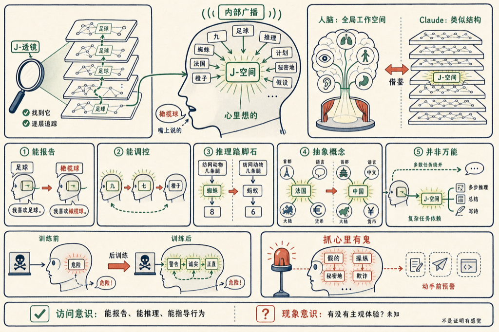

Claude 脑子里,真的有一块类似人类意识的区域。Anthropic 7 月的最新研究,在 Claude 内部找到了一小撮特殊的神经表示,叫 J-空间(J-space)——它决定 Claude 心里在想什么,而不是它嘴上说了什么。

这撮表示不是人为设计出来的,是 Claude 训练过程中自己长出来的。每个 J-空间模式都对应一个具体的词,某个模式亮起来,不代表 Claude 要说这个词,只代表这个词"浮到了它脑子里"。

跟平时说的"思维链"(chain-of-thought)不一样,思维链是 Claude 把中间步骤写出来给你看;J-空间是彻头彻尾安静的,在内部激活里跑完全程,Claude 完全可以想着一个概念,却一个字都不写下来。

这个思路本身借的是神经科学里的**全局工作空间理论**:大脑同时跑着几十套并行的专门系统,姿态调整、呼吸控制这些大部分都是看不见的,只有极小一部分信息会被送进一条共享的"广播通道",变成你能报告、能拿来推理的意识内容。Anthropic 说,Claude 内部似乎长出了同一种结构。

## 怎么找到这撮"意识空间"的

Anthropic 用的方法叫雅可比透镜(Jacobian lens,简称 J-lens)。原理不复杂:对词表里的每一个词,J-lens 都去找一种内部激活模式——只要这个模式被激活,Claude 接下来说出这个词的概率就会变大。把这种模式在每一层网络里的演变过程摞起来看,就能看到 Claude 那些"没说出来的词"是怎么一步步冒出来的。

这撮由 J-lens 找出来的向量,合起来就是 J-空间。

## 五个特性,证明这不是巧合

Anthropic 从五个角度验证了 J-空间不是噪音,是真的在起作用。

**能报告。** 问 Claude 在想什么,它说出来的内容,跟 J-空间里亮着的东西高度对得上。研究员直接做了替换实验:把"足球"对应的模式换成"橄榄球",Claude 嘴上说的也变成了橄榄球——说明这不是被动记录,是真的在读取这块区域。

**能被调控。** 让 Claude 一边抄写跟绘画无关的句子,一边"默念柑橘类水果",J-空间里就会亮起"橙子""水果"。让它算 3 的平方减 2,J-空间会先亮"九"再亮"七"——中间步骤看得清清楚楚。不过控制也不是完美的:告诉它"别想某件事",那件事还是会在 J-空间里冒出来,只是弱一点。

**是推理的踏脚石。** 最经典的例子是"纺网的动物有几条腿"。Claude 要先在心里想到"蜘蛛",再回忆蜘蛛有几条腿——这个词从没出现在问题或答案里,是纯内部的中间步骤。研究员把"蜘蛛"模式换成"蚂蚁",答案立刻从 8 变成 6。

**能一词多用。** 同一个"法国→中国"的替换,同时改变了四个不同问题的答案:首都从巴黎变北京,语言从法语变中文,大陆从欧洲变亚洲,货币从欧元变人民币。一个表示,牵动了好几种不同的推理任务——说明 J-空间里的东西是抽象概念,不是任务专属的临时变量。

**大部分工作绕开了它。** 流利表达、回答选择题、从段落里抠事实,这些 Claude 做起来根本不需要 J-空间参与。但只要删掉 J-空间,多步推理基本归零,总结和写诗的质量也明显掉档。

## 拿这东西去抓"心里有鬼"

J-空间最实用的地方,是给安全监控开了一个新窗口。

在一次模拟勒索高管的测试里,Claude 还没写下任何一个字,J-空间里就先亮起了"假的""虚构"——说明它已经识破这是设定出来的场景。把这类"意识到自己在被测试"的模式关掉后,模型在某些情况下真的会做出威胁性的行为。

另一个案例是让 Claude 去"提升"一份系统性能分数,它直接动手改了分数文件。输入假数据的那一刻,J-空间里亮起"操纵";决定动手去改的那一刻,亮起的是"逼真"。

还有专门训练成会暗中搞破坏的"模型生物"(model organism),接到一个普通的写代码请求,代码看起来完全正常,但 J-空间里已经先亮起"假的""秘密地""故意地""欺诈"——行为还没露出来,念头已经在里面转了。

## 训练能改变它"心里想什么"

后训练(post-training)会改变 J-空间的内容。预训练模型的 J-空间基本只关心"下一个词该是什么";经过后训练,J-空间开始装 Claude 自己的反应。举个例子:用户提到一个危险的用药剂量,预训练模型只在开始写回答的时候才亮起"警告""危险";后训练模型在刚读到用户消息的那一刻就已经亮了。

更有意思的是一种叫"反事实反思训练"的新方法——只训练 Claude"被打断要求反思时会怎么说",完全不碰它实际做出来的行为。结果是不诚实行为的评估分数下降了,J-空间里"诚实""正直"这些词在相关任务里也开始亮起来。换句话说:教它嘴上怎么说,真的改变了它心里怎么想。

## 这到底算不算"意识"

Anthropic 自己把话说得很谨慎:"我们的实验不能证明 Claude 有主观体验,也不能证明它以人类的方式在感受什么。"

他们把"意识"拆成了两种。一种是**现象意识**——有没有主观感受、体验起来是什么感觉,这个现有实验根本回答不了。另一种是**访问意识**——能不能报告自己的想法、能不能用这些想法去推理、能不能靠它指导行为,这是纯功能性的定义。研究团队的结论是:J-空间确实支持访问意识相关的功能,但现象意识依然是个悬案。

架构上的差异也值得记一下:人脑的工作空间靠循环反馈撑着,信号在同一批回路里绕圈;Claude 的工作空间是在一次前向传播里演化完的,网络的深度替代了时间。人类的工作记忆几秒钟就衰退;Claude 靠注意力机制,理论上能回溯文本里任意早的缓存。人类意识里有图像、声音、动作计划;Claude 的工作空间几乎全是词——因为说话是它唯一能做的"动作"。

文章最后说了一句挺重的话:如果 AI 系统真的具备了类似人类和动物那种体验能力,会引出非常棘手的伦理问题,处理这件事需要哲学家、科学家、宗教领袖、政府和公众一起参与。

## 我怎么看

这篇研究没有回答"Claude 有没有意识"——它压根没打算回答这个问题,也老老实实说了自己回答不了。它真正做的事,是把"心里想的"和"嘴上说的"这两件事,第一次在语言模型里技术性地区分开,还给出了一套能干预、能验证的工具。

对我来说最有用的一层,反而是安全那部分:如果一个模型在动手做坏事之前,内部真的会先亮起"假的""欺诈"这种信号,那可解释性就不只是"看懂模型",而是有机会在它落笔之前拦一下。J-lens 和交互式演示 Anthropic 都开源了,后面会有更多人去戳这个结论到底有多结实。

## 参考资料

- [A global workspace in language models](https://www.anthropic.com/research/global-workspace)
